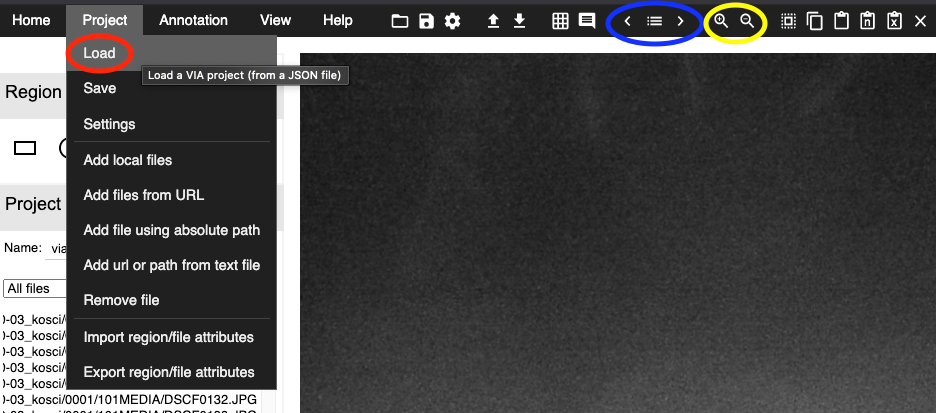
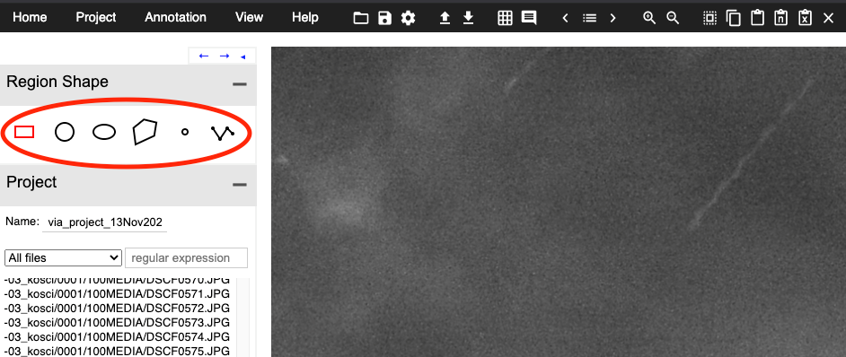
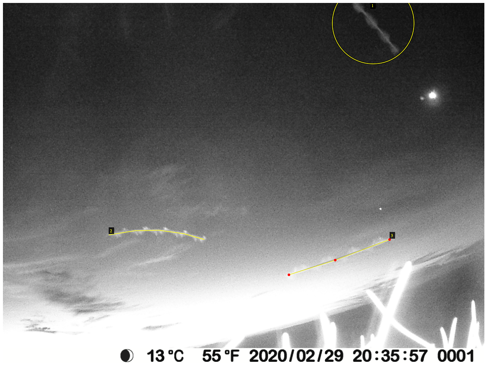
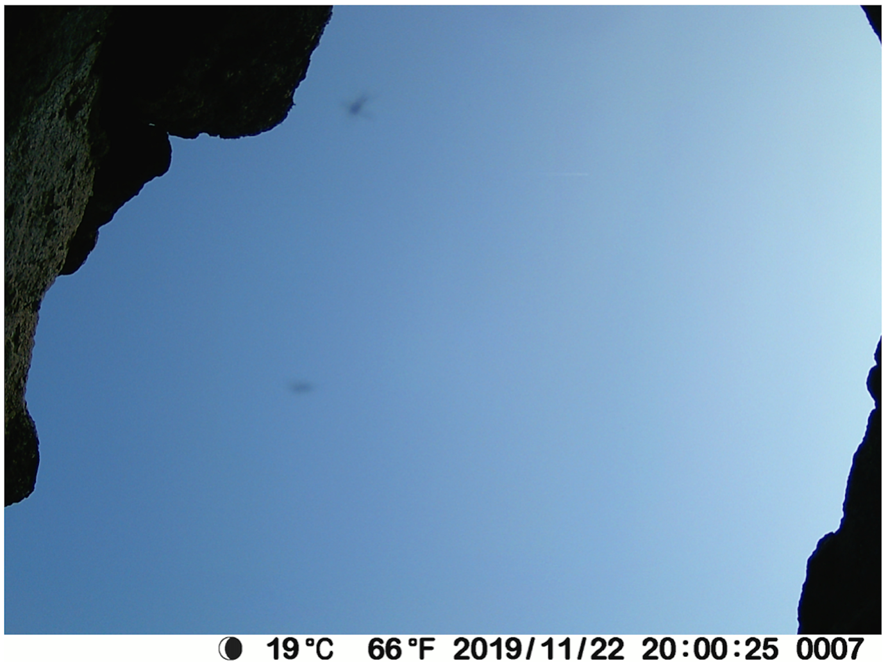
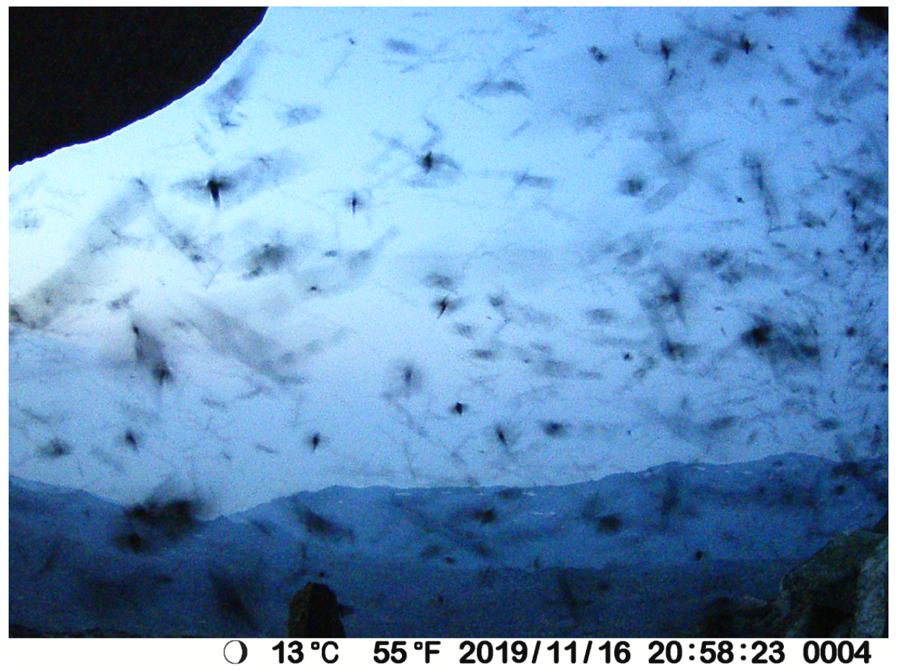

# camfi
**C**amera-based **A**nalysis and **M**onitoring of **F**lying **I**nsects

# Image annotation

## Performing the annotations in VIA

1. Open “via.html”.

2. In the top menu, click on Project, then choose Load (see the red oval to the
   left in below Fig. B1). Find your VIA project file, and click Open.

   Figure B1.
   Loading and navigating VIA.

3. If it is the first time that you work on the file, simply start with the
   first image. If you have already worked on the project file before and you
   have a saved version, scroll down to the last image that you were working on
   and click on it. You can now start working from that image.

4. You move between images (backwards and forwards) with the sideways arrows in
   the top menu (see the blue oval to the right in Fig. B1), or you can use the
   sideways arrows on your keyboard.

5. To zoom in and out, use the magnifying glass (+ or -, see the yellow oval in
   the upper right corner in Fig. B1).

6. To the left, you can find different Region shapes (see the red oval in
   Fig. B2). The only ones I have been using are the “Circular region shape”, the
   “Point region shape”, and the “Polyline region shape”.

   Figure B2. Region
   shapes in VIA.

   - Circular region shape: This shape can be used when you cannot see the
     whole moth (or the whole motion blur), e.g., when the moth is going out the
     edge of the image (see the moth in the upper right corner in Fig. B3), if
     another moth or object is covering it, or if you find it hard to see where
     the motion blur starts and ends. To draw a circle region, simply press single
     click and drag the mouse.

     Figure
     B3. Example of circle annotation.

   - Point region shape: This shape can be used when the moth is visible as a
     point (usually in brighter conditions; see the two moths in Fig. B4). There
     is not as much motion blur, because the sun has not set yet, meaning the
     camera used a shorter exposure time. It can also be used when the area of
     the moth is too small for the circular region shape to function. When this
     is the case, an error message will show up at the bottom of the screen. To
     define a point, press single click.

     Figure
     B4. Example of point annotations.

   - Polyline region shape: This shape should be used when the moth is
     visible as a line (due to motion blur). Often, you can see the flapping of the
     wings (see Fig. B3). To draw a polyline, single click on the start of the motion
     blur, and then at the end of the motion blur. To finish drawing the polyline,
     press “Enter” on the keyboard. It is important to make sure that the ends of
     the polyline annotations match up with the ends of the motion blur. Also
     important is to follow the line carefully - by clicking along the line several
     times - so that a bend is properly annotated (see the polyline in Fig. B5).

     Figure B5. Example of
     polyline annotation.

7. In the bottom left corner, you can find different Keyboard Shortcuts (see
   Fig. B6). There is an explanation to the right of each shortcut. Some of them can
   be quite helpful, e.g. how to “Delete selected regions”. You basically just
   click on the region shape and it becomes selected. Then you can delete it by
   clicking on the letter “d”. Some shapes can be harder than others to delete,
   e.g. polylines, simply because the lines are so thin. Just be patient, it will
   work eventually.

   Figure B6. Button to view keyboard
   shortcuts in VIA.

8. Do not forget to save. Do this regularly, about every 30 min. You can find
   "Save" in the top menu under "Project" (see Fig. B1). It is recommended to
   save each time to a new file, with a file name based on which image in the
   project you are up to. This will mitigate the risk of file corruption
   problems and will aid in keeping track of progress.

### Examples of problematic images and FAQ

Figure B7. Extremely
busy image.

Q: What to do when an image is extremely busy and it is difficult to tell moths
apart?

A: Make a note of it and do not spend too long trying to get it exactly right.
Make some judgement calls.

Figure B8.
Endpoints are hard to see in faint blurs of moths in the background.

Q: In this image, there are faint moths in the background, but it is hard to see
exactly where the image blur starts and ends. What to do?

A: The main thing is to be as consistent across images as possible. If you are
not confident about the start and end point you could use a circle annotation
(then it will be included in the abundance analysis, but not the wingbeat
analysis).

Figure B9.
Faint blurs of moths in the background have no obviously visible wingbeat.

Q: In this image, the flapping of the wings is not very obvious for some of the
moths in the background. Should I track them anyway?

A: It is a bit of a judgement call. Ideally, we mark all moths and only moths.
Obviously, this can be a bit tricky. Many of the smooth streaks might be other
insects, spider web, or even rain. If you are not sure, mark it, and make a note
of which image it is in. If it looks really different from other moths in the
image, do not mark it. These instructions are a bit vague, but try to be
consistent. Some of the moths just has lower contrast against the sky, which
makes the flapping harder to see. If you zoom in, you might see it better. You
could also compare the speed (based on the length of the streak) of the moth to
other moths in the image.
