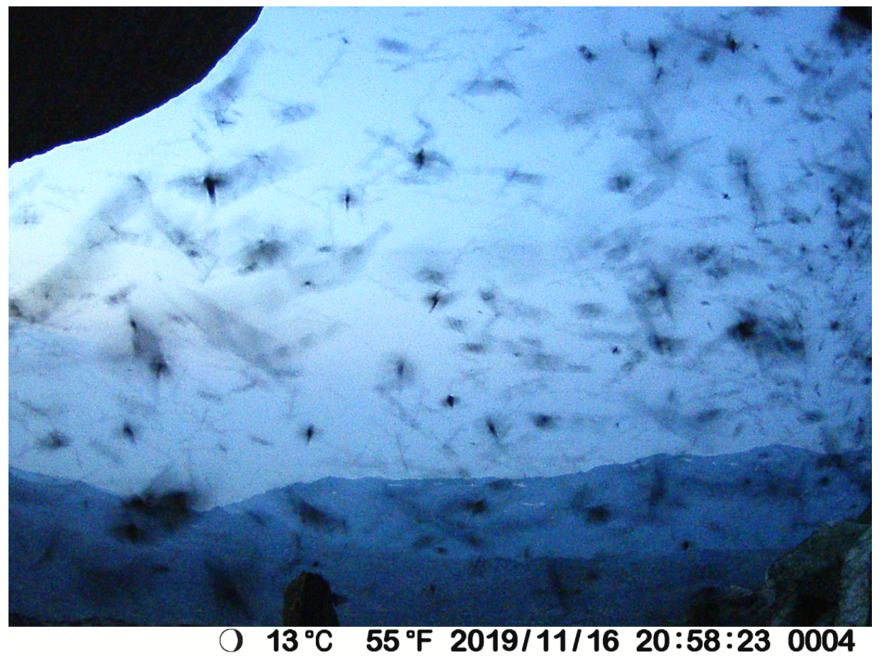
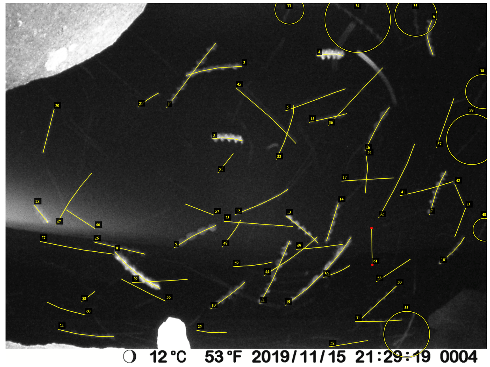
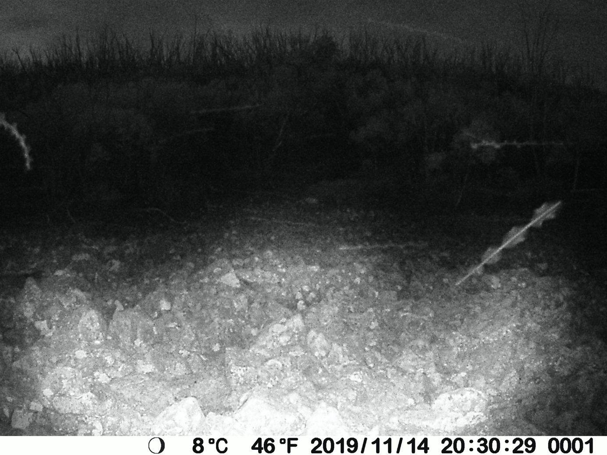

Manual Image annotation
=======================

.. _via-project-setup:

Setting up the VIA project file
-------------------------------

1. Place all the images to be annotated into a single parent directory. They
   may be in sub-directories within this parent directory.

2. Before making the project file, it is necessary to produce a text file which
   contains the relative paths to all of the images to be annotated, one per
   line. It is suggested to generate this on the command line. For example, if
   your file structure is something like this::

      annotation_project            # Parent directory
      ├-- via.html
      ├-- moth_images_november      # Images may be contained within subdirs,
      │   ├-- 0001                  # and these subdirs can be arbitrarily
      │   │   ├-- 100MEDIA          # nested.
      │   │   │   ├-- DSCF0001.JPG
      │   │   │   └--...
      │   │   └-- 101MEDIA
      │   │       ├-- DSCF0001.JPG
      │   │       └--...
      │   └-- 0002
      │       ├-- 100MEDIA
      │       │   ├-- DSCF0001.JPG
      │       │   └--...
      │       └-- 101MEDIA
      │           ├-- DSCF0001.JPG
      │           └--...
      └-- moth_images_december
          ├-- 0001
          │   ├-- 100MEDIA
          │   │   ├-- DSCF0001.JPG
          │   │   └--...
          │   └-- 101MEDIA
          │       ├-- DSCF0001.JPG
          │       └--...
          └-- 0002
              ├-- 100MEDIA
              │   ├-- DSCF0001.JPG
              │   └--...
              └-- 101MEDIA
                  ├-- DSCF0001.JPG
                  └--...

   Then you could generate the required file by running the following bash
   command from within the ``annotation_project`` directory::

      $ ls -1 moth_images_*/*/*/*.JPG > annotation_image_filelist.txt

   Or if using fish-shell, one can easily be more flexible with regard to the
   exact directory structure::

      > ls -1 moth_images_**.JPG > annotation_image_filelist.txt

   You will then end with a file called ``annotation_image_filelist.txt`` in
   the ``annotation_project`` directory, which starts something like this (note
   the exact paths should reflect your directory structure, rather than that of
   this arbitrary example)::

      annotation_project$ head annotation_image_filelist.txt
      moth_images_november/0001/100MEDIA/DSCF0001.JPG
      moth_images_november/0001/100MEDIA/DSCF0002.JPG
      moth_images_november/0001/100MEDIA/DSCF0003.JPG
      moth_images_november/0001/100MEDIA/DSCF0004.JPG
      moth_images_november/0001/100MEDIA/DSCF0005.JPG
      moth_images_november/0001/100MEDIA/DSCF0006.JPG
      moth_images_november/0001/100MEDIA/DSCF0007.JPG
      moth_images_november/0001/100MEDIA/DSCF0008.JPG
      moth_images_november/0001/100MEDIA/DSCF0009.JPG
      moth_images_november/0001/100MEDIA/DSCF0010.JPG

   Note that this file contains relative paths to the images, not absolute
   paths. This is important for making the project portable between machines
   (for example if the annotation work is to be spread between multiple
   people).  Once this file list has been generated, we are ready to set up the
   project in VIA.

3. Ensure "via.html" is placed into the parent directory containing the images
   to be annotated (``annotation_project`` in the above example), then open it
   in you web browser by double-clicking it.

4. In VIA, under "Project" in the top menu bar (see
   :numref:`fig-navigating_via`), select "Add url or path from text file".

5. Navigate to the project directory, and select the file list we generated in
   step 2. The images should appear in the project pane on the left-hand side
   of the screen.

6. After checking that the image files were loaded properly, select "Save"
   under the "Project" menu. Leave the boxes checked, and name the project file
   as you wish. Your web browser will treat this as a file download. Once
   downloaded, you should move the project file into your annotation project
   directory.

Performing the annotations in VIA
---------------------------------

1. Open “via.html”, ensuring it is in the parent directory containing the
   images to be annotated.

2. In the top menu, click on Project, then choose Load (see the red oval to the
   left in below :numref:`fig-navigating_via`). Find your VIA project file, and
   click Open.

   .. _fig-navigating_via:

   .. figure:: figures/navigating_via.png
      :width: 100 %
      :alt: Loading and navigating VIA

      Loading and navigating VIA.

      ..

3. If it is the first time that you work on the file, simply start with the
   first image. If you have already worked on the project file before and you
   have a saved version, scroll down to the last image that you were working on
   and click on it. You can now start working from that image.

4. You move between images (backwards and forwards) with the sideways arrows in
   the top menu (see the blue oval to the right in
   :numref:`fig-navigating_via`), or you can use the sideways arrows on your
   keyboard.

5. To zoom in and out, use the magnifying glass (+ or -, see the yellow oval in
   the upper right corner in :numref:`fig-navigating_via`).

6. To the left, you can find different Region shapes (see the red oval in
   :numref:`fig-region_shapes`). The only ones I have been using are the
   “Circular region shape”, the “Point region shape”, and the “Polyline region
   shape”.

   .. _fig-region_shapes:

   .. figure:: figures/region_shapes.png
      :width: 100 %
      :alt: Region shapes in VIA

      Region shapes in VIA

      ..

   * Circular region shape: This shape can be used when you cannot see the
     whole moth (or the whole motion blur), e.g., when the moth is going out
     the edge of the image (see the moth in the upper right corner in
     :numref:`fig-circle_annotation`), if another moth or object is covering
     it, or if you find it hard to see where the motion blur starts and ends.
     To draw a circle region, simply press single click and drag the mouse.

     .. _fig-circle_annotation:

     .. figure:: figures/circle_annotation.png
        :width: 100 %
        :alt: Example of circle annotation

        Example of circle annotation.

        ..

   * Point region shape: This shape can be used when the moth is visible as a
     point (usually in brighter conditions; see the two moths in
     :numref:`fig-point_annotation`). There is not as much motion blur, because
     the sun has not set yet, meaning the camera used a shorter exposure time.
     It can also be used when the area of the moth is too small for the
     circular region shape to function. When this is the case, an error message
     will show up at the bottom of the screen. To define a point, press single
     click.

     .. _fig-point_annotation:

     .. figure:: figures/point_annotation.png
        :width: 100 %
        :alt: Example of point annotations

        Example of image where point annotations would be appropriate.

        ..

   * Polyline region shape: This shape should be used when the moth is visible
     as a line (due to motion blur). Often, you can see the flapping of the
     wings (see :numref:`fig-circle_annotation`). To draw a polyline, single
     click on the start of the motion blur, and then at the end of the motion
     blur. To finish drawing the polyline, press “Enter” on the keyboard. It is
     important to make sure that the ends of the polyline annotations match up
     with the ends of the motion blur. Also important is to follow the line
     carefully - by clicking along the line several times - so that a bend is
     properly annotated (see the polyline in
     :numref:`fig-polyline_annotation`).

     .. _fig-polyline_annotation:

     .. figure:: figures/polyline_annotation.png
        :width: 100 %
        :alt: Example of polyline annotation

        Example of polyline annotation.

        ..

7. In the bottom left corner, you can find different Keyboard Shortcuts (see
   :numref:`fig-keyboard_shortcuts`). There is an explanation to the right of
   each shortcut. Some of them can be quite helpful, e.g. how to “Delete
   selected regions”. You basically just click on the region shape and it
   becomes selected. Then you can delete it by clicking on the letter “d”. Some
   shapes can be harder than others to delete, e.g. polylines, simply because
   the lines are so thin. Just be patient, it will work eventually.

   .. _fig-keyboard_shortcuts:

   .. figure:: figures/keyboard_shortcuts.png
      :width: 100 %
      :alt: Button to view keyboard shortcuts in VIA

      Button to view keyboard shortcuts in VIA.

      ..

8. Do not forget to save. Do this regularly, about every 30 min. You can find
   "Save" in the top menu under "Project" (see :numref:`fig-navigating_via`).
   It is recommended to save each time to a new file, with a file name based on
   which image in the project you are up to. This will mitigate the risk of
   file corruption problems and will aid in keeping track of progress.

Examples of problematic images and FAQ
^^^^^^^^^^^^^^^^^^^^^^^^^^^^^^^^^^^^^^

.. _fig-problematic_busy:

   Extremely busy image.

   ..

**Q:** What to do when an image is extremely busy and it is difficult to tell
moths apart (:numref:`fig-problematic_busy`)?

**A:** Make a note of it and do not spend too long trying to get it exactly
right.  Make some judgement calls.

.. _fig-problematic_background_moths_endpoints:

   Endpoints are hard to see in faint blurs of moths in the background.

   ..

**Q:** In this image (:numref:`fig-problematic_background_moths_endpoints`),
there are faint moths in the background, but it is hard
to see exactly where the image blur starts and ends. What to do?

**A:** The main thing is to be as consistent across images as possible. If you
are not confident about the start and end point you could use a circle
annotation (then it will be included in the abundance analysis, but not the
wingbeat analysis).

.. _fig-problematic_background_moths_wingbeats:

   Faint blurs of moths in the background have no obviously visible wingbeat.

   ..

**Q:** In this image (:numref:`fig-problematic_background_moths_wingbeats`),
the flapping of the wings is not very obvious for some of
the moths in the background. Should I track them anyway?

**A:** It is a bit of a judgement call. Ideally, we mark all moths and only
moths.  Obviously, this can be a bit tricky. Many of the smooth streaks might
be other insects, spider web, or even rain. If you are not sure, mark it, and
make a note of which image it is in. If it looks really different from other
moths in the image, do not mark it. These instructions are a bit vague, but try
to be consistent. Some of the moths just has lower contrast against the sky,
which makes the flapping harder to see. If you zoom in, you might see it
better. You could also compare the speed (based on the length of the streak) of
the moth to other moths in the image.

Loading the image metadata into the VIA project file
----------------------------------------------------

**Note:** It is recommended to only perform this steps after the annotation has
been completed. This is because including the image metadata in the VIA project
file increases the size of the file substantially, and since it is recommended
to save all incremental versions of the project file, this could become
cumbersome if the metadata is included from the start.

See example notebook :doc:`notebooks/activity_analysis`.
