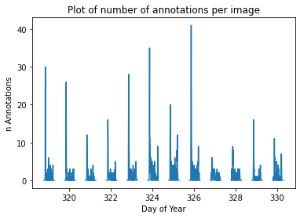
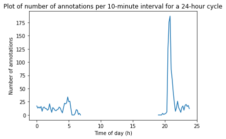
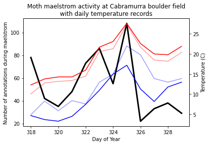
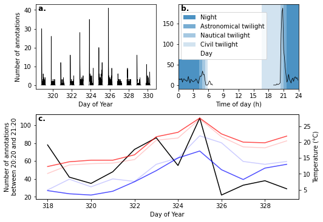
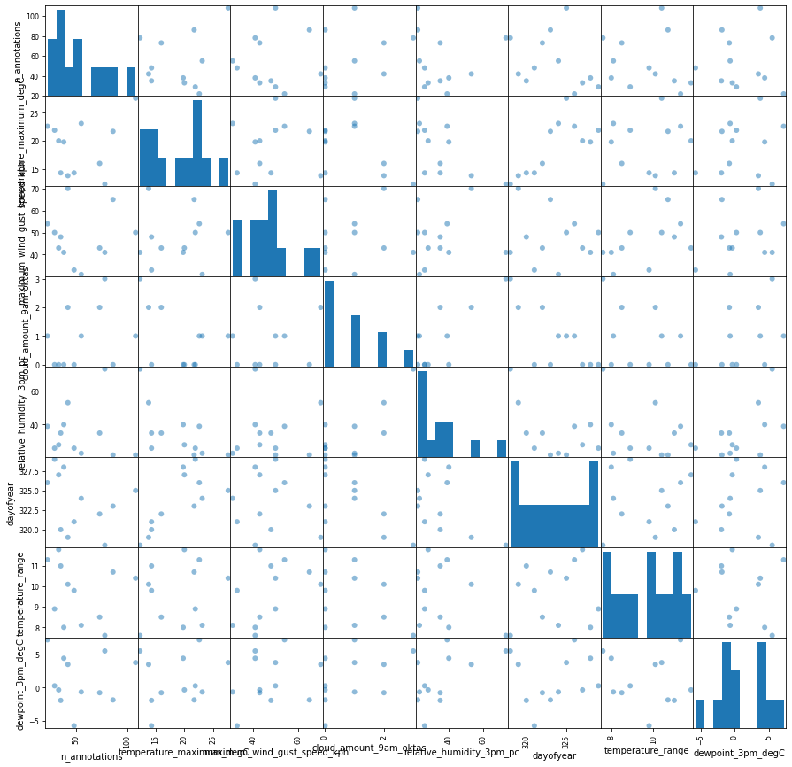
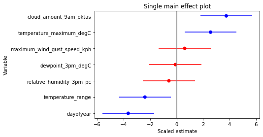
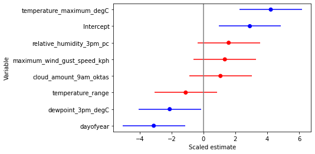
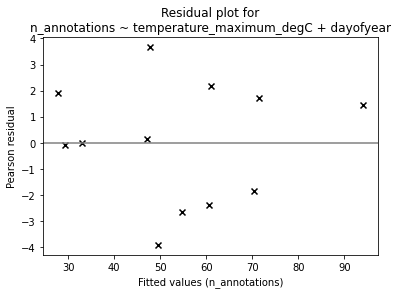
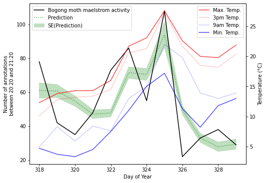
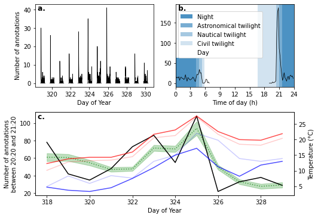

Flying insect activity-levels analysis
======================================

This notebook demonstrates analysis of flying insect activity levels
data from camfi.

First, load the required libraries.

.. code:: ipython3

    import bz2
    import datetime
    import gzip
    import json
    
    from matplotlib import pyplot as plt
    import matplotlib.dates as mdates
    from matplotlib.ticker import MaxNLocator
    import metpy.calc as mpcalc
    from metpy.units import units
    import numpy as np
    import pandas as pd
    from scipy.stats import linregress, chi2
    import statsmodels.api as sm
    import statsmodels.formula.api as smf

Next, load the image metadata (including annotations from VIA). It is in
a json format with the following structure:

::

   {
       "_via_attributes": {
           "file": {
               ...  # Contains default values for image metadata (EXIF) for VIA.
                    # The exact fields may vary with camera model.
           },
           "region": {},
       },
       "_via_img_metadata": {
           "<image_key>" : {
               "file_attributes": {
                   ...  # Contains file-specific values for image metadata (EXIF)
               },
               "filename": ...,  # Path to imager file
               "regions": [...],  # List of annotations which have been made in VIA
               "size": -1
           },
       ...
       },
       "_via_settings": {
           ...  #  Contains project settings for VIA.
       }
   }

Please see the camfi readme for instructions of how to create this file.

The ``"_via_img_metadata"`` part of the annotation file is the part of
interest to us. In particular, we would like to extract the timestamp of
the images and the ``"regions"`` list for each image. Below we load the
data and list the names of the available EXIF fields.

.. code:: ipython3

    # Modify the following line if using different dataset
    data_path = "data/cabramurra_all_annotations.json.bz2"
    
    def decompressed_open(filename, mode="r"):
        """
        Convenience wrapper to handle various types of compressed file. Assumes the filename suffix is correct.
        """
        if filename.endswith(".gz"):
            return gzip.open(filename, mode)
        elif filename.endswith(".bz2"):
            return bz2.open(filename, mode)
        else:
            return open(filename, mode)
    
    with decompressed_open(data_path) as json_file:
        annotation = json.load(json_file)
        
    image_keys = list(annotation["_via_img_metadata"].keys())
    
    print("The available EXIF fields are:", "-" * 30, *annotation["_via_attributes"]["file"], sep="\n")

.. parsed-literal::

    The available EXIF fields are:
    ------------------------------
    datetime_original
    exposure_time
    pixel_x_dimension
    pixel_y_dimension

With the data loaded, we can then make a summary of the number of
annotations per image, as well as extracting the timestamp of the images
from the camera’s EXIF metadata. We will store this information in a
Pandas dataframe.

From the above list of available EXIF metadata fields, we can see that
the timestamp field is called ``"DateTimeOriginal"``.

Note that a mistake was made when setting up camera 0004. Namely, the
timestamps for all images from that camera are one month (31 days)
behind. We will fix that now.

.. code:: ipython3

    img_dates, filenames, n_annotations = [], [], []
    
    for i, img_key in enumerate(image_keys):
        filename = annotation["_via_img_metadata"][img_key]["filename"]
        datetime_to_append = pd.to_datetime(
            annotation["_via_img_metadata"][img_key]["file_attributes"]["datetime_original"], format="%Y:%m:%d %H:%M:%S"
        )
        
        # Fixing incorrect timestamps. Comment the following two lines if using a different dataset:
        if "/0004/" in filename:
            datetime_to_append += pd.to_timedelta(31, "D")
            
        img_dates.append(datetime_to_append)
        filenames.append(filename)
        n_annotations.append(len(annotation["_via_img_metadata"][img_key]["regions"]))    
        
    df = pd.DataFrame(
        data=dict(
            timestamp=img_dates,
            filename=filenames,
            n_annotations=n_annotations,
        ),
    )
    df.set_index("timestamp", drop=False, inplace=True)
    
    df.sort_index(inplace=True)
    
    print(f"Total annotations: {df['n_annotations'].sum()}")
    
    df

.. parsed-literal::

    Total annotations: 1419

.. raw:: html

    

    
    <table border="1" class="dataframe">
      <thead>
        <tr style="text-align: right;">
          <th></th>
          <th>timestamp</th>
          <th>filename</th>
          <th>n_annotations</th>
        </tr>
        <tr>
          <th>timestamp</th>
          <th></th>
          <th></th>
          <th></th>
        </tr>
      </thead>
      <tbody>
        <tr>
          <th>2019-11-14 19:00:03</th>
          <td>2019-11-14 19:00:03</td>
          <td>2019-11_cabramurra/0001/DSCF0001.JPG</td>
          <td>0</td>
        </tr>
        <tr>
          <th>2019-11-14 19:00:03</th>
          <td>2019-11-14 19:00:03</td>
          <td>2019-11_cabramurra/0004/DSCF0001.JPG</td>
          <td>0</td>
        </tr>
        <tr>
          <th>2019-11-14 19:00:03</th>
          <td>2019-11-14 19:00:03</td>
          <td>2019-11_cabramurra/0003/DSCF0001.JPG</td>
          <td>0</td>
        </tr>
        <tr>
          <th>2019-11-14 19:00:03</th>
          <td>2019-11-14 19:00:03</td>
          <td>2019-11_cabramurra/0007/DSCF0001.JPG</td>
          <td>0</td>
        </tr>
        <tr>
          <th>2019-11-14 19:00:03</th>
          <td>2019-11-14 19:00:03</td>
          <td>2019-11_cabramurra/0009/DSCF0001.JPG</td>
          <td>0</td>
        </tr>
        <tr>
          <th>...</th>
          <td>...</td>
          <td>...</td>
          <td>...</td>
        </tr>
        <tr>
          <th>2019-11-26 06:53:38</th>
          <td>2019-11-26 06:53:38</td>
          <td>2019-11_cabramurra/0008/DSCF0864.JPG</td>
          <td>0</td>
        </tr>
        <tr>
          <th>2019-11-26 06:53:38</th>
          <td>2019-11-26 06:53:38</td>
          <td>2019-11_cabramurra/0007/DSCF0864.JPG</td>
          <td>0</td>
        </tr>
        <tr>
          <th>2019-11-26 06:53:38</th>
          <td>2019-11-26 06:53:38</td>
          <td>2019-11_cabramurra/0001/DSCF0864.JPG</td>
          <td>0</td>
        </tr>
        <tr>
          <th>2019-11-26 06:53:39</th>
          <td>2019-11-26 06:53:39</td>
          <td>2019-11_cabramurra/0006/DSCF0864.JPG</td>
          <td>0</td>
        </tr>
        <tr>
          <th>2019-11-26 06:53:39</th>
          <td>2019-11-26 06:53:39</td>
          <td>2019-11_cabramurra/0002/DSCF0864.JPG</td>
          <td>0</td>
        </tr>
      </tbody>
    </table>
    
8640 rows × 3 columns

    

To get a general overview of the activity levels observed throughout the
study period, we pool the data from all cameras and plot the number of
annotations per 10-minute interval:

.. code:: ipython3

    df["dayofyear"] = df["timestamp"].dt.dayofyear + \
                      df["timestamp"].dt.hour.values / 24 + \
                      df["timestamp"].dt.minute.values / 1440
    
    fig = plt.figure()
    ax = fig.add_subplot(
        111,
        title="Plot of number of annotations per image",
        ylabel="n Annotations",
        xlabel="Day of Year"
    )
    
    h, bx, by = np.histogram2d(
        df["dayofyear"],
        df["n_annotations"],
        bins = [
            np.arange(min(df["dayofyear"]) - 1 / 288, max(df["dayofyear"]) + 1 / 288, 1 / 144),
            np.arange(-0.5, max(df["n_annotations"]) + 1, 1)
        ]
    )
    
    b_midpoints = (bx[:-1] + bx[1:]) / 2
    
    n_annotations_per10min = (h * np.arange(h.shape[1]).reshape((1, h.shape[1]))).sum(axis=1)
    n_annotations_per10min[h.sum(axis=1) == 0.] = np.nan
    
    p = ax.plot(b_midpoints, n_annotations_per10min)

The gaps in the above figure are periods where the cameras were not set
to take photos (they were only set to take photos between the hours of
19:00-07:00 AEDT each night).

There seems to be a periodic signal in the data, with more activity in
the evening. We can take a closer look at this by pooling the data from
all days into a single representative 24-hour period.

.. code:: ipython3

    df["dayhour"] = (df["dayofyear"] - np.floor(df["dayofyear"])) * 24.
    
    fig = plt.figure()
    ax = fig.add_subplot(
        111,
        title="Plot of number of annotations per 10-minute interval for a 24-hour cycle",
        ylabel="Number of annotations",
        xlabel="Time of day (h)"
    )
    
    h24, bx24, by24 = np.histogram2d(
        df["dayhour"],
        df["n_annotations"],
        bins = [
            np.arange(-1 / 12, 24 + 1 / 6, 1 / 6),
            np.arange(-0.5, max(df["n_annotations"]) + 1, 1)
        ]
    )
    
    b24_midpoints = (bx24[:-1] + bx24[1:]) / 2
    
    n_annotations_per10min24 = (h24 * np.arange(h24.shape[1]).reshape((1, h24.shape[1]))).sum(axis=1)
    n_annotations_per10min24[h24.sum(axis=1) == 0.] = np.nan
    
    p = ax.plot(b24_midpoints, n_annotations_per10min24)

In the above figure we see a striking increase in activity levels during
the hours of 20:20-21:20. This seems to be when the most insects are
flying.

Taking the mean number of annotations per image during this period for
each day, we can then look at how activity levels were across the days
of the study period. Next, we merge these daily activity levels with
daily temperature data from the Bureau of Meterology.

.. code:: ipython3

    # Summarising evening activity across each study day
    df_maelstrom = df[(df.dayhour >= 20 + 20 / 60) & (df.dayhour < 21 + 20 / 60)]
    maelstrom_intensity = df_maelstrom.groupby(df_maelstrom["timestamp"].dt.date)["n_annotations"].sum()
    maelstrom_intensity = pd.DataFrame(maelstrom_intensity)
    maelstrom_intensity["date"] = pd.to_datetime(maelstrom_intensity.index)
    
    # Loading weather data
    weather_data_path = "data/cabramurra_bom_weather_201911.csv"
    weather_df = pd.read_csv(weather_data_path, skiprows=6, header=0)
    weather_df["date"] = pd.to_datetime(weather_df["date"])
    for timekey in [
        "sunrise",
        "sunset",
        "astronomical_twilight_start",
        "astronomical_twilight_end",
        "nautical_twilight_start",
        "nautical_twilight_end",
        "civil_twilight_start",
        "civil_twilight_end",
        "solar_noon"
    ]:
        weather_df[timekey] = pd.to_datetime(weather_df[timekey]).dt.hour + pd.to_datetime(weather_df[timekey]).dt.minute / 60
    
    # temperature_minimum_degC is taken from the 24h until 9am.
    # We are interested in the minimum temperature in the 24h from 9am.
    weather_df["temperature_minimum_evening_degC"] = np.nan
    weather_df.loc[:28, "temperature_minimum_evening_degC"] = weather_df["temperature_minimum_degC"][1:].array
    
    # Database merge of evening activity and daily weather data
    maelstrom_weather = maelstrom_intensity.merge(
        weather_df,
        how="left",
        on="date",
    )
    
    # Include dayofyear in maelstrom_weather
    maelstrom_weather["dayofyear"] = maelstrom_weather.date.dt.dayofyear
    
    maelstrom_weather

.. raw:: html

    

    
    <table border="1" class="dataframe">
      <thead>
        <tr style="text-align: right;">
          <th></th>
          <th>n_annotations</th>
          <th>date</th>
          <th>temperature_minimum_degC</th>
          <th>temperature_maximum_degC</th>
          <th>rainfall_mm</th>
          <th>maximum_wind_gust_direction</th>
          <th>maximum_wind_gust_speed_kph</th>
          <th>maximum_wind_gust_time</th>
          <th>temperature_9am_degC</th>
          <th>relative_humidity_9am_pc</th>
          <th>...</th>
          <th>sunset</th>
          <th>astronomical_twilight_start</th>
          <th>astronomical_twilight_end</th>
          <th>nautical_twilight_start</th>
          <th>nautical_twilight_end</th>
          <th>civil_twilight_start</th>
          <th>civil_twilight_end</th>
          <th>solar_noon</th>
          <th>temperature_minimum_evening_degC</th>
          <th>dayofyear</th>
        </tr>
      </thead>
      <tbody>
        <tr>
          <th>0</th>
          <td>78</td>
          <td>2019-11-14</td>
          <td>-0.6</td>
          <td>12.3</td>
          <td>0.0</td>
          <td>W</td>
          <td>41</td>
          <td>23:04</td>
          <td>4.9</td>
          <td>95</td>
          <td>...</td>
          <td>15.833333</td>
          <td>4.200000</td>
          <td>21.500000</td>
          <td>4.816667</td>
          <td>20.883333</td>
          <td>5.383333</td>
          <td>20.300000</td>
          <td>12.833333</td>
          <td>4.7</td>
          <td>318</td>
        </tr>
        <tr>
          <th>1</th>
          <td>42</td>
          <td>2019-11-15</td>
          <td>4.7</td>
          <td>13.8</td>
          <td>0.0</td>
          <td>WNW</td>
          <td>70</td>
          <td>12:54</td>
          <td>8.3</td>
          <td>73</td>
          <td>...</td>
          <td>15.850000</td>
          <td>4.183333</td>
          <td>21.516667</td>
          <td>4.800000</td>
          <td>20.900000</td>
          <td>5.366667</td>
          <td>20.316667</td>
          <td>12.833333</td>
          <td>3.7</td>
          <td>319</td>
        </tr>
        <tr>
          <th>2</th>
          <td>35</td>
          <td>2019-11-16</td>
          <td>3.7</td>
          <td>14.3</td>
          <td>0.0</td>
          <td>WNW</td>
          <td>48</td>
          <td>16:22</td>
          <td>5.9</td>
          <td>69</td>
          <td>...</td>
          <td>15.866667</td>
          <td>4.166667</td>
          <td>21.533333</td>
          <td>4.783333</td>
          <td>20.916667</td>
          <td>5.350000</td>
          <td>20.333333</td>
          <td>12.850000</td>
          <td>3.3</td>
          <td>320</td>
        </tr>
        <tr>
          <th>3</th>
          <td>48</td>
          <td>2019-11-17</td>
          <td>3.3</td>
          <td>14.3</td>
          <td>0.0</td>
          <td>WNW</td>
          <td>33</td>
          <td>12:48</td>
          <td>8.4</td>
          <td>42</td>
          <td>...</td>
          <td>15.883333</td>
          <td>4.150000</td>
          <td>21.566667</td>
          <td>4.766667</td>
          <td>20.933333</td>
          <td>5.350000</td>
          <td>20.350000</td>
          <td>12.850000</td>
          <td>4.5</td>
          <td>321</td>
        </tr>
        <tr>
          <th>4</th>
          <td>73</td>
          <td>2019-11-18</td>
          <td>4.5</td>
          <td>16.0</td>
          <td>0.0</td>
          <td>WNW</td>
          <td>43</td>
          <td>15:49</td>
          <td>7.6</td>
          <td>45</td>
          <td>...</td>
          <td>15.900000</td>
          <td>4.133333</td>
          <td>21.583333</td>
          <td>4.750000</td>
          <td>20.950000</td>
          <td>5.333333</td>
          <td>20.383333</td>
          <td>12.850000</td>
          <td>7.5</td>
          <td>322</td>
        </tr>
        <tr>
          <th>5</th>
          <td>86</td>
          <td>2019-11-19</td>
          <td>7.5</td>
          <td>21.7</td>
          <td>0.0</td>
          <td>WNW</td>
          <td>65</td>
          <td>12:28</td>
          <td>13.0</td>
          <td>41</td>
          <td>...</td>
          <td>15.916667</td>
          <td>4.116667</td>
          <td>21.616667</td>
          <td>4.733333</td>
          <td>20.983333</td>
          <td>5.316667</td>
          <td>20.400000</td>
          <td>12.850000</td>
          <td>11.0</td>
          <td>323</td>
        </tr>
        <tr>
          <th>6</th>
          <td>55</td>
          <td>2019-11-20</td>
          <td>11.0</td>
          <td>23.1</td>
          <td>0.0</td>
          <td>WNW</td>
          <td>31</td>
          <td>13:41</td>
          <td>15.0</td>
          <td>31</td>
          <td>...</td>
          <td>15.933333</td>
          <td>4.100000</td>
          <td>21.633333</td>
          <td>4.733333</td>
          <td>21.000000</td>
          <td>5.316667</td>
          <td>20.416667</td>
          <td>12.850000</td>
          <td>15.0</td>
          <td>324</td>
        </tr>
        <tr>
          <th>7</th>
          <td>108</td>
          <td>2019-11-21</td>
          <td>15.0</td>
          <td>27.6</td>
          <td>0.0</td>
          <td>NNW</td>
          <td>50</td>
          <td>13:43</td>
          <td>22.0</td>
          <td>27</td>
          <td>...</td>
          <td>15.950000</td>
          <td>4.083333</td>
          <td>21.650000</td>
          <td>4.716667</td>
          <td>21.016667</td>
          <td>5.300000</td>
          <td>20.433333</td>
          <td>12.866667</td>
          <td>17.2</td>
          <td>325</td>
        </tr>
        <tr>
          <th>8</th>
          <td>22</td>
          <td>2019-11-22</td>
          <td>17.2</td>
          <td>22.6</td>
          <td>0.0</td>
          <td>NNW</td>
          <td>54</td>
          <td>23:22</td>
          <td>19.8</td>
          <td>34</td>
          <td>...</td>
          <td>15.966667</td>
          <td>4.066667</td>
          <td>21.683333</td>
          <td>4.700000</td>
          <td>21.033333</td>
          <td>5.283333</td>
          <td>20.450000</td>
          <td>12.866667</td>
          <td>11.3</td>
          <td>326</td>
        </tr>
        <tr>
          <th>9</th>
          <td>33</td>
          <td>2019-11-23</td>
          <td>11.3</td>
          <td>20.0</td>
          <td>0.0</td>
          <td>WNW</td>
          <td>43</td>
          <td>12:53</td>
          <td>13.9</td>
          <td>36</td>
          <td>...</td>
          <td>15.983333</td>
          <td>4.050000</td>
          <td>21.700000</td>
          <td>4.683333</td>
          <td>21.066667</td>
          <td>5.283333</td>
          <td>20.466667</td>
          <td>12.866667</td>
          <td>8.2</td>
          <td>327</td>
        </tr>
        <tr>
          <th>10</th>
          <td>38</td>
          <td>2019-11-24</td>
          <td>8.2</td>
          <td>19.8</td>
          <td>0.0</td>
          <td>WNW</td>
          <td>41</td>
          <td>14:56</td>
          <td>13.0</td>
          <td>60</td>
          <td>...</td>
          <td>20.000000</td>
          <td>4.033333</td>
          <td>21.733333</td>
          <td>4.683333</td>
          <td>21.083333</td>
          <td>5.266667</td>
          <td>20.483333</td>
          <td>12.866667</td>
          <td>11.8</td>
          <td>328</td>
        </tr>
        <tr>
          <th>11</th>
          <td>29</td>
          <td>2019-11-25</td>
          <td>11.8</td>
          <td>21.9</td>
          <td>0.0</td>
          <td>WNW</td>
          <td>50</td>
          <td>10:02</td>
          <td>13.9</td>
          <td>33</td>
          <td>...</td>
          <td>20.016667</td>
          <td>4.016667</td>
          <td>21.750000</td>
          <td>4.666667</td>
          <td>21.100000</td>
          <td>5.266667</td>
          <td>20.500000</td>
          <td>12.883333</td>
          <td>13.0</td>
          <td>329</td>
        </tr>
      </tbody>
    </table>
    
12 rows × 28 columns

    

Now we can plot these data:

.. code:: ipython3

    fig = plt.figure()
    ax1 = fig.add_subplot(
        111,
        title="Moth maelstrom activity at Cabramurra boulder field\nwith daily temperature records",
        ylabel="Number of annotations during maelstrom",
        xlabel="Day of Year",
    )
    ax2 = ax1.twinx()
    ax2.set_ylabel("Temperature (C)")
    
    # Plotting insect evening activity levels
    ax1.plot(
        maelstrom_weather["dayofyear"],
        maelstrom_weather["n_annotations"],
        c="k",
        lw=3,
        label="Bogong moth maelstrom activity",
    )
    
    # Plotting daily temperature data
    ax2.plot(
        maelstrom_weather["dayofyear"],
        maelstrom_weather["temperature_maximum_degC"],
        c="r",
        label="Maximum temperature (C)",
    )
    ax2.plot(
        maelstrom_weather["dayofyear"],
        maelstrom_weather["temperature_3pm_degC"],
        c="r",
        alpha=0.4,
        label="3pm Temperature (C)",
    )
    ax2.plot(
        maelstrom_weather["dayofyear"],
        maelstrom_weather["temperature_minimum_evening_degC"],
        c="b",
        label="Minimum temperature (C)",
    )
    ax2.plot(
        maelstrom_weather["dayofyear"],
        maelstrom_weather["temperature_9am_degC"],
        c="b",
        alpha=0.4,
        label="9am Temperature (C)",
    )

.. parsed-literal::

    [<matplotlib.lines.Line2D at 0x7f900b97a5d0>]

Finally, we can combine the above plots into a single figure:

.. code:: ipython3

    b_legend_loc = 0.02, 0.35
    
    fig = plt.figure(
        figsize=(7.5, 5.2),
        #dpi=1000.0,
        tight_layout=True,
    )
    title_y = 0.88
    
    ax1 = fig.add_subplot(
        221,
        xlabel="Day of Year",
        ylabel="Number of annotations",
    )
    ax1.set_title(" a.", fontdict={"fontweight": "bold"}, loc="left", y=title_y)
    ax1.plot(b_midpoints, n_annotations_per10min, c="k", lw=0.75)
    ax1.xaxis.set_major_locator(MaxNLocator(integer=True))
    
    ax2 = fig.add_subplot(
        222,
        xlabel="Time of day (h)",
        xlim=(0., 24.),
    )
    ax2.plot(b24_midpoints, n_annotations_per10min24, c="k", lw=0.75)
    
    ax2.axvspan(
        0.,
        maelstrom_weather["astronomical_twilight_start"].mean(),
        ymax=b_legend_loc[1],
        alpha=0.8,
        label="Night",
    )
    
    ax2.axvspan(
        maelstrom_weather["astronomical_twilight_start"].mean(),
        maelstrom_weather["nautical_twilight_start"].mean(),
        ymax=b_legend_loc[1],
        alpha=0.6,
        label="Astronomical twilight",
    )
    
    ax2.axvspan(
        maelstrom_weather["nautical_twilight_start"].mean(),
        maelstrom_weather["civil_twilight_start"].mean(),
        ymax=b_legend_loc[1],
        alpha=0.4,
        label="Nautical twilight",
    )
    
    ax2.axvspan(
        maelstrom_weather["civil_twilight_start"].mean(),
        maelstrom_weather["sunrise"].mean(),
        ymax=b_legend_loc[1],
        alpha=0.2,
        label="Civil twilight",
    )
    
    ax2.axvspan(
        maelstrom_weather["sunrise"].mean(),
        maelstrom_weather["sunset"].mean(),
        ymax=b_legend_loc[1],
        alpha=0.,
        label="Day",
    )
    
    ax2.axvspan(
        maelstrom_weather["astronomical_twilight_end"].mean(),
        24.,
        alpha=0.8,
    )
    
    ax2.axvspan(
        maelstrom_weather["nautical_twilight_end"].mean(),
        maelstrom_weather["astronomical_twilight_end"].mean(),
        alpha=0.6,
    )
    
    ax2.axvspan(
        
        maelstrom_weather["civil_twilight_end"].mean(),
        maelstrom_weather["nautical_twilight_end"].mean(),
        alpha=0.4,
    )
    
    ax2.axvspan(
        maelstrom_weather["sunset"].mean(),
        maelstrom_weather["civil_twilight_end"].mean(),
        alpha=0.2,
    )
    
    ax2.legend(loc=b_legend_loc)
    ax2.set_title(" b.", fontdict={"fontweight": "bold"}, loc="left", y=title_y, zorder=10)
    ax2.xaxis.set_major_locator(MaxNLocator(integer=True))
    
    ax3 = fig.add_subplot(
        212,
        xlabel="Day of Year",
        ylabel="Number of annotations\nbetween 20:20 and 21:20",    
    )
    ax3.set_title(" c.", fontdict={"fontweight": "bold"}, loc="left", y=title_y)
    ax3.plot(
        maelstrom_weather["dayofyear"],
        maelstrom_weather["n_annotations"],
        c="k",
        label="Bogong moth maelstrom activity",
    )
    
    ax4 = ax3.twinx()
    ax4.set_ylabel("Temperature (°C)")
    ax4.plot(
        maelstrom_weather["dayofyear"],
        maelstrom_weather["temperature_maximum_degC"],
        c="r",
        alpha=0.7,
        label="Maximum temperature (C)",
    )
    ax4.plot(
        maelstrom_weather["dayofyear"],
        maelstrom_weather["temperature_3pm_degC"],
        c="r",
        alpha=0.2,
        label="3pm Temperature (C)",
    )
    ax4.plot(
        maelstrom_weather["dayofyear"],
        maelstrom_weather["temperature_minimum_evening_degC"],
        c="b",
        alpha=0.7,
        label="Minimum temperature (C)",
    )
    ax4.plot(
        maelstrom_weather["dayofyear"],
        maelstrom_weather["temperature_9am_degC"],
        c="b",
        alpha=0.2,
        label="9am Temperature (C)",
    )

.. parsed-literal::

    [<matplotlib.lines.Line2D at 0x7f900b760b10>]

We then may like to regress the activity levels against various factors.
Given the activity level count data, we can proceed using a Poisson
regression of ``n_annotations`` vs. the independent variables of
interest.

First, we will select non-correlated covariates from
``maelstrom_weather``. Here we can add derived covariates, such as
``temperature_range`` and ``dewpoint_degC``.

.. code:: ipython3

    maelstrom_weather["temperature_range"] = maelstrom_weather.temperature_maximum_degC - maelstrom_weather.temperature_minimum_evening_degC
    maelstrom_weather["dewpoint_3pm_degC"] = mpcalc.dewpoint_from_relative_humidity(
        units.Quantity(maelstrom_weather["temperature_3pm_degC"].array, "degC"),
        units.Quantity(maelstrom_weather["relative_humidity_3pm_pc"].array, "percent"),
    )
    list(maelstrom_weather.columns)

.. parsed-literal::

    ['n_annotations',
     'date',
     'temperature_minimum_degC',
     'temperature_maximum_degC',
     'rainfall_mm',
     'maximum_wind_gust_direction',
     'maximum_wind_gust_speed_kph',
     'maximum_wind_gust_time',
     'temperature_9am_degC',
     'relative_humidity_9am_pc',
     'cloud_amount_9am_oktas',
     'wind_direction_9am',
     'wind_speed_9am_kph',
     'temperature_3pm_degC',
     'relative_humidity_3pm_pc',
     'wind_direction_3pm',
     'wind_speed_3pm_kph',
     'sunrise',
     'sunset',
     'astronomical_twilight_start',
     'astronomical_twilight_end',
     'nautical_twilight_start',
     'nautical_twilight_end',
     'civil_twilight_start',
     'civil_twilight_end',
     'solar_noon',
     'temperature_minimum_evening_degC',
     'dayofyear',
     'temperature_range',
     'dewpoint_3pm_degC']

We will comment out the ones we don’t want to use, then plot the pairs
to make sure we haven’t missed any glaringly corrrelated covariates

.. code:: ipython3

    covariates = [
        #"date",                        # Use dayofyear instead
        #"temperature_minimum_degC",    # Correlated with temperature_maximum_degC
        "temperature_maximum_degC",
        #"rainfall_mm",                 # All of these are 0. in our data
        "maximum_wind_gust_speed_kph",
        #"temperature_9am_degC",        # Correlated with temperature_maximum_degC
        #"relative_humidity_9am_pc",    # Correlated with relative_humidity_3pm_pc
        "cloud_amount_9am_oktas",
        #"wind_direction_9am",          # Wind direction did not vary much over the experiment
        #"wind_speed_9am_kph",          # Correlated with maximum_wind_gust_speed_kph
        #"temperature_3pm_degC",        # Correlated with temperature_maximum_degC
        "relative_humidity_3pm_pc",
        #"wind_direction_3pm",          # Wind direction did not vary much over the experiment
        #"wind_speed_3pm_kph",          # Correlated with maximum_wind_gust_speed_kph
        "dayofyear",
        "temperature_range",
        "dewpoint_3pm_degC",
    ]
    
    grr = pd.plotting.scatter_matrix(
        maelstrom_weather[["n_annotations", *covariates]],
        marker='o',
        figsize=(15, 15),
    )

Fitting a Poisson GLM of ``n_annotations`` vs. each covariate
individually, and plotting the effect:

.. code:: ipython3

    pois = sm.families.Poisson()
    
    tvalues = []
    pvalues = []
    for covariate in covariates:
        mod = smf.glm(
            f"n_annotations ~ {covariate}",
            data=maelstrom_weather,
            family=pois,
        )
        res = mod.fit()
        tvalues.append(res.tvalues[1])
        pvalues.append(res.pvalues[1])
        
    tvalues = np.array(tvalues)
    pvalues = np.array(pvalues)
    
    ordering = np.argsort(tvalues)
    coloring = np.array(["r", "b"])[(pvalues[ordering] < 0.05).astype("u1")]
    
    fig = plt.figure()
    ax = fig.add_subplot(
        111,
        title="Single main effect plot",
        xlabel="Scaled estimate",
        ylabel="Variable",
    )
    ax.axvline(0, c="gray")
    ax.hlines(np.array(covariates)[ordering], tvalues[ordering] - 1.96, tvalues[ordering] + 1.96, color=coloring)
    p = ax.scatter(tvalues[ordering], np.array(covariates)[ordering], color=coloring)

Fitting a Poisson GLM of ``n_annotations`` vs. all of the covariates,
and plotting the effect:

.. code:: ipython3

    mod = smf.glm(
        "n_annotations ~ " + " + ".join(covariates),
        data=maelstrom_weather,
        family=pois,
    )
    res = mod.fit()
    print(res.summary())
    print(f"res.aic={res.aic}")
    
    ordering = np.argsort(res.tvalues)
    coloring = np.array(["r", "b"])[(res.pvalues[ordering] < 0.05).astype("u1")]
    
    fig = plt.figure()
    ax = fig.add_subplot(
        111,
        xlabel="Scaled estimate",
        ylabel="Variable",
    )
    ax.axvline(0, c="gray")
    ax.hlines(res.tvalues.index[ordering], res.tvalues[ordering] - 1.96, res.tvalues[ordering] + 1.96, color=coloring)
    p = ax.scatter(res.tvalues[ordering], res.tvalues.index[ordering], color=coloring)

.. parsed-literal::

                     Generalized Linear Model Regression Results                  
    ==============================================================================
    Dep. Variable:          n_annotations   No. Observations:                   11
    Model:                            GLM   Df Residuals:                        3
    Model Family:                 Poisson   Df Model:                            7
    Link Function:                    log   Scale:                          1.0000
    Method:                          IRLS   Log-Likelihood:                -51.152
    Date:                Tue, 08 Jun 2021   Deviance:                       39.053
    Time:                        16:03:33   Pearson chi2:                     37.8
    No. Iterations:                     4                                         
    Covariance Type:            nonrobust                                         
    ===============================================================================================
                                      coef    std err          z      P>|z|      [0.025      0.975]
    -----------------------------------------------------------------------------------------------
    Intercept                      35.3783     12.151      2.911      0.004      11.562      59.195
    temperature_maximum_degC        0.1581      0.037      4.226      0.000       0.085       0.231
    maximum_wind_gust_speed_kph     0.0063      0.005      1.344      0.179      -0.003       0.016
    cloud_amount_9am_oktas          0.1229      0.115      1.069      0.285      -0.102       0.348
    relative_humidity_3pm_pc        0.0260      0.016      1.583      0.113      -0.006       0.058
    dayofyear                      -0.1083      0.035     -3.116      0.002      -0.176      -0.040
    temperature_range              -0.0620      0.056     -1.112      0.266      -0.171       0.047
    dewpoint_3pm_degC              -0.1201      0.057     -2.116      0.034      -0.231      -0.009
    ===============================================================================================
    res.aic=118.30309891303736

We can see that in both cases, ``temperature_maximum_degC`` has the
largest effect ``n_annotations`` of all of the weather variables. Here
we fit the Poisson regression model
``n_annotations ~ temperature_maximum_degC``, which can be interpreted
as “Moth activity level scales with maximum temperature”.

.. code:: ipython3

    mod = smf.glm(
        "n_annotations ~ temperature_maximum_degC",
        data=maelstrom_weather,
        family=pois,
    )
    res = mod.fit()
    print(res.summary())
    print("p-values (t-test):", res.pvalues, sep="\n")
    print("t-values:", res.tvalues, sep="\n")
    print(f"res.aic={res.aic}")
    print(res.wald_test("(temperature_maximum_degC = 0)"))

.. parsed-literal::

                     Generalized Linear Model Regression Results                  
    ==============================================================================
    Dep. Variable:          n_annotations   No. Observations:                   12
    Model:                            GLM   Df Residuals:                       10
    Model Family:                 Poisson   Df Model:                            1
    Link Function:                    log   Scale:                          1.0000
    Method:                          IRLS   Log-Likelihood:                -99.853
    Date:                Tue, 08 Jun 2021   Deviance:                       131.06
    Time:                        16:03:33   Pearson chi2:                     130.
    No. Iterations:                     4                                         
    Covariance Type:            nonrobust                                         
    ============================================================================================
                                   coef    std err          z      P>|z|      [0.025      0.975]
    --------------------------------------------------------------------------------------------
    Intercept                    3.5628      0.172     20.683      0.000       3.225       3.900
    temperature_maximum_degC     0.0221      0.009      2.562      0.010       0.005       0.039
    ============================================================================================
    p-values (t-test):
    Intercept                   4.877395e-95
    temperature_maximum_degC    1.039621e-02
    dtype: float64
    t-values:
    Intercept                   20.683497
    temperature_maximum_degC     2.562365
    dtype: float64
    res.aic=203.7065985681451
    <Wald test (chi2): statistic=[[6.56571312]], p-value=0.01039620705501461, df_denom=1>

We may also be interested in extending this model to allow for the date
to affect the moth activity levels (i.e. due to moths arriving or
leaving the locale):

.. code:: ipython3

    mod = smf.glm(
        "n_annotations ~ temperature_maximum_degC + dayofyear",
        data=maelstrom_weather,
        family=pois,
    )
    res = mod.fit()
    print(res.summary())
    print("p-values (t-test):", res.pvalues, sep="\n")
    print("t-values:", res.tvalues, sep="\n")
    print(f"res.aic={res.aic}")
    print(res.wald_test("(temperature_maximum_degC = 0), (dayofyear = 0)"))

.. parsed-literal::

                     Generalized Linear Model Regression Results                  
    ==============================================================================
    Dep. Variable:          n_annotations   No. Observations:                   12
    Model:                            GLM   Df Residuals:                        9
    Model Family:                 Poisson   Df Model:                            2
    Link Function:                    log   Scale:                          1.0000
    Method:                          IRLS   Log-Likelihood:                -65.144
    Date:                Tue, 08 Jun 2021   Deviance:                       61.639
    Time:                        16:03:33   Pearson chi2:                     58.5
    No. Iterations:                     4                                         
    Covariance Type:            nonrobust                                         
    ============================================================================================
                                   coef    std err          z      P>|z|      [0.025      0.975]
    --------------------------------------------------------------------------------------------
    Intercept                   51.1104      6.077      8.410      0.000      39.200      63.021
    temperature_maximum_degC     0.0976      0.012      8.104      0.000       0.074       0.121
    dayofyear                   -0.1516      0.019     -7.829      0.000      -0.190      -0.114
    ============================================================================================
    p-values (t-test):
    Intercept                   4.085973e-17
    temperature_maximum_degC    5.327756e-16
    dayofyear                   4.921493e-15
    dtype: float64
    t-values:
    Intercept                   8.410405
    temperature_maximum_degC    8.103780
    dayofyear                  -7.828902
    dtype: float64
    res.aic=136.28734846809104
    <Wald test (chi2): statistic=[[72.12851911]], p-value=2.175159365199668e-16, df_denom=2>

Note that the above model fits the data much better, while only adding
one parameter.

To check that nothing strange is going on, we can plot the residuals:

.. code:: ipython3

    fig = plt.figure()
    ax = fig.add_subplot(
        111,
        title=f"Residual plot for\n{mod.formula}",
        ylabel="Pearson residual",
        xlabel="Fitted values (n_annotations)",
    )
    
    ax.axhline(0, c="gray")
    p = ax.scatter(res.fittedvalues, res.resid_pearson, marker="x", c="k")

And finally, we can re-plot subfigure **c.** from above, this time
including the predicted values for ``n_annotations``.

.. code:: ipython3

    prediction = res.get_prediction()
    
    fig = plt.figure(
        figsize=(7.5, 5.2),
        #dpi=1000.0,
        tight_layout=True,
    )
    
    ax3 = fig.add_subplot(
        111,
        xlabel="Day of Year",
        ylabel="Number of annotations\nbetween 20:20 and 21:20",    
    )
    ax3.plot(
        maelstrom_weather["dayofyear"],
        maelstrom_weather["n_annotations"],
        c="k",
        label="Bogong moth maelstrom activity",
    )
    
    ax4 = ax3.twinx()
    ax4.set_ylabel("Temperature (°C)")
    ax4.plot(
        maelstrom_weather["dayofyear"],
        maelstrom_weather["temperature_maximum_degC"],
        c="r",
        alpha=0.7,
        label="Max. Temp.",
    )
    ax4.plot(
        maelstrom_weather["dayofyear"],
        maelstrom_weather["temperature_3pm_degC"],
        c="r",
        alpha=0.2,
        label="3pm Temp.",
    )
    ax4.plot(
        maelstrom_weather["dayofyear"],
        maelstrom_weather["temperature_9am_degC"],
        c="b",
        alpha=0.2,
        label="9am Temp.",
    )
    ax4.plot(
        maelstrom_weather["dayofyear"],
        maelstrom_weather["temperature_minimum_evening_degC"],
        c="b",
        alpha=0.7,
        label="Min. Temp.",
    )
    
    ax3.fill_between(
        maelstrom_weather["dayofyear"],
        prediction.predicted_mean - prediction.se_mean,
        prediction.predicted_mean + prediction.se_mean,
        color="g",
        alpha=0.25,
        linestyle="dotted",
        label="SE(Prediction)",
    )
    ax3.plot(
        maelstrom_weather["dayofyear"],
        prediction.predicted_mean,
        c="g",
        alpha=0.7,
        linestyle="dotted",
        label="Prediction",
    )
    
    ax3.legend(loc="upper left")
    ax4.legend(loc="upper right")

.. parsed-literal::

    <matplotlib.legend.Legend at 0x7f9009ce0a50>

Putting it all together for the publication:

.. code:: ipython3

    fig_width = 180  # mm
    fig_width /= 25.4  # inches
    fig_height = fig_width * 3 / 4
    
    fig = plt.figure(
        figsize=(fig_width, fig_height),
        tight_layout=True,
    )
    title_y = 0.88
    
    ax1 = fig.add_subplot(
        221,
        xlabel="Day of Year",
        ylabel="Number of annotations",
    )
    ax1.set_title(" (a)", fontdict={"fontweight": "bold"}, loc="left", y=title_y)
    ax1.plot(b_midpoints, n_annotations_per10min, c="k", lw=0.75)
    ax1.xaxis.set_major_locator(MaxNLocator(integer=True))
    
    ax2 = fig.add_subplot(
        222,
        xlabel="Time of day (h)",
        xlim=(0., 24.),
    )
    
    ax2.plot(b24_midpoints, n_annotations_per10min24, c="k", lw=0.75)
    
    ax2.axvspan(
        0.,
        maelstrom_weather["astronomical_twilight_start"].mean(),
        ymax=b_legend_loc[1],
        alpha=0.8,
        label="Night",
    )
    
    ax2.axvspan(
        maelstrom_weather["astronomical_twilight_start"].mean(),
        maelstrom_weather["nautical_twilight_start"].mean(),
        ymax=b_legend_loc[1],
        alpha=0.6,
        label="Astronomical twilight",
    )
    
    ax2.axvspan(
        maelstrom_weather["nautical_twilight_start"].mean(),
        maelstrom_weather["civil_twilight_start"].mean(),
        ymax=b_legend_loc[1],
        alpha=0.4,
        label="Nautical twilight",
    )
    
    ax2.axvspan(
        maelstrom_weather["civil_twilight_start"].mean(),
        maelstrom_weather["sunrise"].mean(),
        ymax=b_legend_loc[1],
        alpha=0.2,
        label="Civil twilight",
    )
    
    ax2.axvspan(
        maelstrom_weather["sunrise"].mean(),
        maelstrom_weather["sunset"].mean(),
        ymax=b_legend_loc[1],
        alpha=0.,
        label="Day",
    )
    
    ax2.axvspan(
        maelstrom_weather["astronomical_twilight_end"].mean(),
        24.,
        alpha=0.8,
    )
    
    ax2.axvspan(
        maelstrom_weather["nautical_twilight_end"].mean(),
        maelstrom_weather["astronomical_twilight_end"].mean(),
        alpha=0.6,
    )
    
    ax2.axvspan(
        
        maelstrom_weather["civil_twilight_end"].mean(),
        maelstrom_weather["nautical_twilight_end"].mean(),
        alpha=0.4,
    )
    
    ax2.axvspan(
        maelstrom_weather["sunset"].mean(),
        maelstrom_weather["civil_twilight_end"].mean(),
        alpha=0.2,
    )
    
    ax2.legend(loc=b_legend_loc)
    ax2.set_title(" (b)", fontdict={"fontweight": "bold"}, loc="left", y=title_y, zorder=10)
    ax2.xaxis.set_major_locator(MaxNLocator(integer=True))
    
    ax3 = fig.add_subplot(
        212,
        xlabel="Day of Year",
        ylabel="Number of annotations\nbetween 20:20 and 21:20",    
    )
    ax3.set_title(" (c)", fontdict={"fontweight": "bold"}, loc="left", y=title_y)
    ax3.plot(
        maelstrom_weather["dayofyear"],
        maelstrom_weather["n_annotations"],
        c="k",
        label="Bogong moth maelstrom activity",
    )
    
    ax4 = ax3.twinx()
    ax4.set_ylabel("Temperature (°C)")
    ax4.plot(
        maelstrom_weather["dayofyear"],
        maelstrom_weather["temperature_maximum_degC"],
        c="r",
        alpha=0.7,
        label="Maximum temperature (C)",
    )
    ax4.plot(
        maelstrom_weather["dayofyear"],
        maelstrom_weather["temperature_3pm_degC"],
        c="r",
        alpha=0.2,
        label="3pm Temperature (C)",
    )
    ax4.plot(
        maelstrom_weather["dayofyear"],
        maelstrom_weather["temperature_minimum_evening_degC"],
        c="b",
        alpha=0.7,
        label="Minimum temperature (C)",
    )
    ax4.plot(
        maelstrom_weather["dayofyear"],
        maelstrom_weather["temperature_9am_degC"],
        c="b",
        alpha=0.2,
        label="9am Temperature (C)",
    )
    
    ax3.fill_between(
        maelstrom_weather["dayofyear"],
        prediction.predicted_mean - prediction.se_mean,
        prediction.predicted_mean + prediction.se_mean,
        color="g",
        alpha=0.25,
        label="SE(Prediction)",
    )
    ax3.plot(
        maelstrom_weather["dayofyear"],
        prediction.predicted_mean,
        c="g",
        alpha=0.7,
        linestyle="dotted",
        label="Prediction",
    )

.. parsed-literal::

    [<matplotlib.lines.Line2D at 0x7f9009ed78d0>]

.. code:: ipython3

    fig.savefig("activity_levels_figure.pdf", dpi=600.0, pad_inches=0.0)
