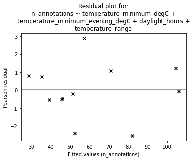

Flying insect activity-levels analysis
======================================

This notebook demonstrates analysis of flying insect activity levels
data from camfi.

First, load the required libraries.

.. code:: ipython3

    from datetime import datetime, timedelta, timezone
    import itertools
    import textwrap
    
    from matplotlib import pyplot as plt
    from matplotlib.ticker import MaxNLocator
    import numpy as np
    import pandas as pd
    import scipy as sp
    import statsmodels.api as sm
    import statsmodels.formula.api as smf
    
    from camfi.projectconfig import CamfiConfig
    from camfi.plotting.matplotlib import (
        plot_activity_levels_summary,
        plot_activity_levels_summaries,
        plot_maelstroms_with_temperature,
    )

Next, load the image metadata (including annotations from VIA). This
file should have the corrected image capture timestamps (refer to the
Wingbeat Analysis notebook).

.. code:: ipython3

    config_path = "data/cabramurra_config.yml"
    
    config = CamfiConfig.parse_yaml_file(config_path)
    
    # We can print out our config using config.json() or config.yaml()
    print(config.json(exclude_unset=True, indent=2))

.. parsed-literal::

    {
      "root": "data",
      "via_project_file": "data/cabramurra_all_annotations.json",
      "day_zero": "2019-01-01",
      "output_tz": "+10:00",
      "camera": {
        "camera_time_to_actual_time_ratio": 1.0,
        "line_rate": 90500.0
      },
      "time": {
        "camera_placements": {
          "2019-11_cabramurra/0004": {
            "camera_start_time": "2019-10-14T13:00:00+11:00",
            "actual_start_time": "2019-11-14T13:00:00+11:00",
            "location": "cabramurra"
          },
          "2019-11_cabramurra": {
            "camera_start_time": "2019-11-14T13:00:00+11:00",
            "location": "cabramurra"
          }
        }
      },
      "place": {
        "locations": [
          {
            "name": "cabramurra",
            "lat": -35.9507,
            "lon": 148.3972,
            "elevation_m": 1513.9,
            "tz": "+10:00"
          }
        ],
        "weather_stations": [
          {
            "location": {
              "name": "cabramurra_smhea_aws_072161",
              "lat": -35.94,
              "lon": 148.38,
              "elevation_m": 1482.4,
              "tz": "+10:00"
            },
            "data_file": "data/cabramurra_bom_weather_201911.csv"
          }
        ],
        "location_weather_station_mapping": {
          "cabramurra": "cabramurra_smhea_aws_072161"
        }
      },
      "wingbeat_extraction": {
        "device": "cpu",
        "scan_distance": 50
      },
      "annotator": {
        "crop": {
          "x0": 0,
          "y0": 0,
          "x1": 4608,
          "y1": 3312
        },
        "training": {
          "mask_maker": {
            "shape": [
              3312,
              4608
            ],
            "mask_dilate": 5
          },
          "min_annotations": 1,
          "max_annotations": 50,
          "test_set_file": "data/cabramurra_test_set.txt",
          "device": "cuda",
          "batch_size": 5,
          "num_workers": 2,
          "num_epochs": 20,
          "save_intermediate": true
        },
        "inference": {
          "output_path": "data/cabramurra_autoannotated.json",
          "device": "cuda",
          "backup_device": "cpu",
          "score_thresh": 0.0
        },
        "validation": {
          "autoannotated_via_project_file": "data/cabramurra_autoannotated.json",
          "image_sets": [
            "all",
            "test",
            "train"
          ],
          "output_dir": "data"
        }
      }
    }

To get the timestamps for the images, we need to read the EXIF metadata
from the image files. Here we also apply time correction. The code is
commented out since the metadata has already been loaded into
``"data/cabramurra_all_annotations.json"``, but if you are working with
a different dataset, or would like to re-run IO intensive this step,
uncomment the code.

**Note:** It is assumed you have downloaded and extracted the images to
``"data/"``. Of course you can extract it elsewhere and change ``root``
config variable accordingly. The repository containing the images used
in this example can be found here:
https://doi.org/10.5281/zenodo.4950570.

.. code:: ipython3

    # Uncomment if exif metadata hasn't been loaded already.
    # config.load_all_exif_metadata()

After running the above two steps, you might like to save the results to
a new VIA project file. Uncommenting the following will save a new VIA
project file to ``"data/all_annotations_with_metadata.json"``.

.. code:: ipython3

    # with open("data/all_annotations_with_metadata.json", "w") as f:
    #     f.write(config.via_project.json(indent=2, exclude_unset=True))

For the following analyses, we need a Pandas DataFrame. The folowwing
command builds a dataframe with an entry for each image, with data taken
from sources specified in the config. We will also convert all the
``datetime_corrected`` values to AEST (+10:00, set in config file) - in
our data they are in AEDT (+11:00).

.. code:: ipython3

    df = config.get_merged_dataframe()
    df

.. raw:: html

    

    
    <table border="1" class="dataframe">
      <thead>
        <tr style="text-align: right;">
          <th></th>
          <th></th>
          <th>img_key</th>
          <th>filename</th>
          <th>n_annotations</th>
          <th>datetime_corrected</th>
          <th>datetime_original</th>
          <th>exposure_time</th>
          <th>pixel_x_dimension</th>
          <th>pixel_y_dimension</th>
          <th>astronomical_twilight_start</th>
          <th>nautical_twilight_start</th>
          <th>...</th>
          <th>maximum_wind_gust_time</th>
          <th>temperature_9am_degC</th>
          <th>relative_humidity_9am_pc</th>
          <th>cloud_amount_9am_oktas</th>
          <th>wind_direction_9am</th>
          <th>wind_speed_9am_kph</th>
          <th>temperature_3pm_degC</th>
          <th>relative_humidity_3pm_pc</th>
          <th>wind_direction_3pm</th>
          <th>wind_speed_3pm_kph</th>
        </tr>
        <tr>
          <th>location</th>
          <th>date</th>
          <th></th>
          <th></th>
          <th></th>
          <th></th>
          <th></th>
          <th></th>
          <th></th>
          <th></th>
          <th></th>
          <th></th>
          <th></th>
          <th></th>
          <th></th>
          <th></th>
          <th></th>
          <th></th>
          <th></th>
          <th></th>
          <th></th>
          <th></th>
          <th></th>
        </tr>
      </thead>
      <tbody>
        <tr>
          <th rowspan="11" valign="top">cabramurra</th>
          <th>2019-11-14</th>
          <td>2019-11_cabramurra/0001/DSCF0001.JPG-1</td>
          <td>2019-11_cabramurra/0001/DSCF0001.JPG</td>
          <td>0</td>
          <td>2019-11-14 18:00:03+10:00</td>
          <td>2019-11-14 19:00:03</td>
          <td>0.012048</td>
          <td>4608</td>
          <td>3456</td>
          <td>2019-11-14 03:12:20.886936+10:00</td>
          <td>2019-11-14 03:49:05.935004+10:00</td>
          <td>...</td>
          <td>23:04</td>
          <td>4.9</td>
          <td>95</td>
          <td>3.0</td>
          <td>W</td>
          <td>17</td>
          <td>10.1</td>
          <td>73</td>
          <td>W</td>
          <td>22</td>
        </tr>
        <tr>
          <th>2019-11-14</th>
          <td>2019-11_cabramurra/0001/DSCF0002.JPG-1</td>
          <td>2019-11_cabramurra/0001/DSCF0002.JPG</td>
          <td>0</td>
          <td>2019-11-14 18:10:06+10:00</td>
          <td>2019-11-14 19:10:06</td>
          <td>0.009174</td>
          <td>4608</td>
          <td>3456</td>
          <td>2019-11-14 03:12:20.886936+10:00</td>
          <td>2019-11-14 03:49:05.935004+10:00</td>
          <td>...</td>
          <td>23:04</td>
          <td>4.9</td>
          <td>95</td>
          <td>3.0</td>
          <td>W</td>
          <td>17</td>
          <td>10.1</td>
          <td>73</td>
          <td>W</td>
          <td>22</td>
        </tr>
        <tr>
          <th>2019-11-14</th>
          <td>2019-11_cabramurra/0001/DSCF0003.JPG-1</td>
          <td>2019-11_cabramurra/0001/DSCF0003.JPG</td>
          <td>0</td>
          <td>2019-11-14 18:20:09+10:00</td>
          <td>2019-11-14 19:20:09</td>
          <td>0.012048</td>
          <td>4608</td>
          <td>3456</td>
          <td>2019-11-14 03:12:20.886936+10:00</td>
          <td>2019-11-14 03:49:05.935004+10:00</td>
          <td>...</td>
          <td>23:04</td>
          <td>4.9</td>
          <td>95</td>
          <td>3.0</td>
          <td>W</td>
          <td>17</td>
          <td>10.1</td>
          <td>73</td>
          <td>W</td>
          <td>22</td>
        </tr>
        <tr>
          <th>2019-11-14</th>
          <td>2019-11_cabramurra/0001/DSCF0004.JPG-1</td>
          <td>2019-11_cabramurra/0001/DSCF0004.JPG</td>
          <td>0</td>
          <td>2019-11-14 18:30:11+10:00</td>
          <td>2019-11-14 19:30:11</td>
          <td>0.020833</td>
          <td>4608</td>
          <td>3456</td>
          <td>2019-11-14 03:12:20.886936+10:00</td>
          <td>2019-11-14 03:49:05.935004+10:00</td>
          <td>...</td>
          <td>23:04</td>
          <td>4.9</td>
          <td>95</td>
          <td>3.0</td>
          <td>W</td>
          <td>17</td>
          <td>10.1</td>
          <td>73</td>
          <td>W</td>
          <td>22</td>
        </tr>
        <tr>
          <th>2019-11-14</th>
          <td>2019-11_cabramurra/0001/DSCF0005.JPG-1</td>
          <td>2019-11_cabramurra/0001/DSCF0005.JPG</td>
          <td>0</td>
          <td>2019-11-14 18:40:14+10:00</td>
          <td>2019-11-14 19:40:14</td>
          <td>0.033333</td>
          <td>4608</td>
          <td>3456</td>
          <td>2019-11-14 03:12:20.886936+10:00</td>
          <td>2019-11-14 03:49:05.935004+10:00</td>
          <td>...</td>
          <td>23:04</td>
          <td>4.9</td>
          <td>95</td>
          <td>3.0</td>
          <td>W</td>
          <td>17</td>
          <td>10.1</td>
          <td>73</td>
          <td>W</td>
          <td>22</td>
        </tr>
        <tr>
          <th>...</th>
          <td>...</td>
          <td>...</td>
          <td>...</td>
          <td>...</td>
          <td>...</td>
          <td>...</td>
          <td>...</td>
          <td>...</td>
          <td>...</td>
          <td>...</td>
          <td>...</td>
          <td>...</td>
          <td>...</td>
          <td>...</td>
          <td>...</td>
          <td>...</td>
          <td>...</td>
          <td>...</td>
          <td>...</td>
          <td>...</td>
          <td>...</td>
        </tr>
        <tr>
          <th>2019-11-26</th>
          <td>2019-11_cabramurra/0010/DSCF0860.JPG-1</td>
          <td>2019-11_cabramurra/0010/DSCF0860.JPG</td>
          <td>0</td>
          <td>2019-11-26 05:13:26+10:00</td>
          <td>2019-11-26 06:13:26</td>
          <td>0.033333</td>
          <td>4608</td>
          <td>3456</td>
          <td>2019-11-26 03:00:54.332543+10:00</td>
          <td>2019-11-26 03:39:54.781647+10:00</td>
          <td>...</td>
          <td>13:34</td>
          <td>13.6</td>
          <td>55</td>
          <td>8.0</td>
          <td>NNW</td>
          <td>41</td>
          <td>3.1</td>
          <td>99</td>
          <td>WNW</td>
          <td>35</td>
        </tr>
        <tr>
          <th>2019-11-26</th>
          <td>2019-11_cabramurra/0010/DSCF0861.JPG-1</td>
          <td>2019-11_cabramurra/0010/DSCF0861.JPG</td>
          <td>0</td>
          <td>2019-11-26 05:23:29+10:00</td>
          <td>2019-11-26 06:23:29</td>
          <td>0.033333</td>
          <td>4608</td>
          <td>3456</td>
          <td>2019-11-26 03:00:54.332543+10:00</td>
          <td>2019-11-26 03:39:54.781647+10:00</td>
          <td>...</td>
          <td>13:34</td>
          <td>13.6</td>
          <td>55</td>
          <td>8.0</td>
          <td>NNW</td>
          <td>41</td>
          <td>3.1</td>
          <td>99</td>
          <td>WNW</td>
          <td>35</td>
        </tr>
        <tr>
          <th>2019-11-26</th>
          <td>2019-11_cabramurra/0010/DSCF0862.JPG-1</td>
          <td>2019-11_cabramurra/0010/DSCF0862.JPG</td>
          <td>0</td>
          <td>2019-11-26 05:33:31+10:00</td>
          <td>2019-11-26 06:33:31</td>
          <td>0.023810</td>
          <td>4608</td>
          <td>3456</td>
          <td>2019-11-26 03:00:54.332543+10:00</td>
          <td>2019-11-26 03:39:54.781647+10:00</td>
          <td>...</td>
          <td>13:34</td>
          <td>13.6</td>
          <td>55</td>
          <td>8.0</td>
          <td>NNW</td>
          <td>41</td>
          <td>3.1</td>
          <td>99</td>
          <td>WNW</td>
          <td>35</td>
        </tr>
        <tr>
          <th>2019-11-26</th>
          <td>2019-11_cabramurra/0010/DSCF0863.JPG-1</td>
          <td>2019-11_cabramurra/0010/DSCF0863.JPG</td>
          <td>0</td>
          <td>2019-11-26 05:43:34+10:00</td>
          <td>2019-11-26 06:43:34</td>
          <td>0.018182</td>
          <td>4608</td>
          <td>3456</td>
          <td>2019-11-26 03:00:54.332543+10:00</td>
          <td>2019-11-26 03:39:54.781647+10:00</td>
          <td>...</td>
          <td>13:34</td>
          <td>13.6</td>
          <td>55</td>
          <td>8.0</td>
          <td>NNW</td>
          <td>41</td>
          <td>3.1</td>
          <td>99</td>
          <td>WNW</td>
          <td>35</td>
        </tr>
        <tr>
          <th>2019-11-26</th>
          <td>2019-11_cabramurra/0010/DSCF0864.JPG-1</td>
          <td>2019-11_cabramurra/0010/DSCF0864.JPG</td>
          <td>0</td>
          <td>2019-11-26 05:53:37+10:00</td>
          <td>2019-11-26 06:53:37</td>
          <td>0.013889</td>
          <td>4608</td>
          <td>3456</td>
          <td>2019-11-26 03:00:54.332543+10:00</td>
          <td>2019-11-26 03:39:54.781647+10:00</td>
          <td>...</td>
          <td>13:34</td>
          <td>13.6</td>
          <td>55</td>
          <td>8.0</td>
          <td>NNW</td>
          <td>41</td>
          <td>3.1</td>
          <td>99</td>
          <td>WNW</td>
          <td>35</td>
        </tr>
      </tbody>
    </table>
    
8640 rows × 36 columns

    

To get a general overview of the activity levels observed throughout the
study period, we pool the data from all cameras and plot the number of
annotations per 10-minute interval:

.. code:: ipython3

    # Setting frame of reference and
    # adding a daynumber column to df, for simpler plots
    df["daynumber"] = (
        df["datetime_corrected"] - config.timestamp_zero
    ).dt.total_seconds() / 86400

.. code:: ipython3

    location_names = [location.name for location in config.place.locations]
    fig = plot_activity_levels_summaries(
        df,
        location_names,
        x_column="daynumber",
        bin_width=10 / 1440,   # 10 minutes
        ax_kwargs=dict(
            ylabel="Number of annotations in 10 min bins",
            xlabel="Day Number"
        ),
        c="k",
    )

The gaps in the above figure are periods where the cameras were not set
to take photos (they were only set to take photos between the hours of
19:00-07:00 AEDT each night).

There seems to be a periodic signal in the data, with more activity in
the evening. We can take a closer look at this by pooling the data from
all days into a single representative 24-hour period.

.. code:: ipython3

    df["dayhour"] = (df["daynumber"] - np.floor(df["daynumber"])) * 24.
    
    fig = plot_activity_levels_summaries(
        df,
        location_names,
        x_column="dayhour",
        bin_width=10 / 60,   # 10 minutes
        ax_kwargs=dict(
            ylabel="Number of annotations in 10 min bins",
            xlabel="Time of day (h)"
        ),
        c="k",
    )

In the above figure we see a striking increase in activity levels during
the hours of 19:20-20:20. This seems to be when the most insects are
flying.

Instead of binning this data by absolute time of day, it would be nice
to bin it according to the relative time from astronomical events, eg.
sunset.

Here we calculate a “within_twilight” column, which is time after
sunset, scaled to the duration of twilight. We’ll also calculate a
“daylight_hours” column, which will be used later.

.. code:: ipython3

    df["within_twilight"] = (
        df["datetime_corrected"] - df["sunset"]
    ) / (
        df["astronomical_twilight_end"] - df["sunset"]
    ) 
    df["daylight_hours"] = (df["sunset"] - df["sunrise"]).dt.total_seconds() / 3600
    
    df

.. raw:: html

    

    
    <table border="1" class="dataframe">
      <thead>
        <tr style="text-align: right;">
          <th></th>
          <th></th>
          <th>img_key</th>
          <th>filename</th>
          <th>n_annotations</th>
          <th>datetime_corrected</th>
          <th>datetime_original</th>
          <th>exposure_time</th>
          <th>pixel_x_dimension</th>
          <th>pixel_y_dimension</th>
          <th>astronomical_twilight_start</th>
          <th>nautical_twilight_start</th>
          <th>...</th>
          <th>wind_direction_9am</th>
          <th>wind_speed_9am_kph</th>
          <th>temperature_3pm_degC</th>
          <th>relative_humidity_3pm_pc</th>
          <th>wind_direction_3pm</th>
          <th>wind_speed_3pm_kph</th>
          <th>daynumber</th>
          <th>dayhour</th>
          <th>within_twilight</th>
          <th>daylight_hours</th>
        </tr>
        <tr>
          <th>location</th>
          <th>date</th>
          <th></th>
          <th></th>
          <th></th>
          <th></th>
          <th></th>
          <th></th>
          <th></th>
          <th></th>
          <th></th>
          <th></th>
          <th></th>
          <th></th>
          <th></th>
          <th></th>
          <th></th>
          <th></th>
          <th></th>
          <th></th>
          <th></th>
          <th></th>
          <th></th>
        </tr>
      </thead>
      <tbody>
        <tr>
          <th rowspan="11" valign="top">cabramurra</th>
          <th>2019-11-14</th>
          <td>2019-11_cabramurra/0001/DSCF0001.JPG-1</td>
          <td>2019-11_cabramurra/0001/DSCF0001.JPG</td>
          <td>0</td>
          <td>2019-11-14 18:00:03+10:00</td>
          <td>2019-11-14 19:00:03</td>
          <td>0.012048</td>
          <td>4608</td>
          <td>3456</td>
          <td>2019-11-14 03:12:20.886936+10:00</td>
          <td>2019-11-14 03:49:05.935004+10:00</td>
          <td>...</td>
          <td>W</td>
          <td>17</td>
          <td>10.1</td>
          <td>73</td>
          <td>W</td>
          <td>22</td>
          <td>317.750035</td>
          <td>18.000833</td>
          <td>-0.504471</td>
          <td>13.978719</td>
        </tr>
        <tr>
          <th>2019-11-14</th>
          <td>2019-11_cabramurra/0001/DSCF0002.JPG-1</td>
          <td>2019-11_cabramurra/0001/DSCF0002.JPG</td>
          <td>0</td>
          <td>2019-11-14 18:10:06+10:00</td>
          <td>2019-11-14 19:10:06</td>
          <td>0.009174</td>
          <td>4608</td>
          <td>3456</td>
          <td>2019-11-14 03:12:20.886936+10:00</td>
          <td>2019-11-14 03:49:05.935004+10:00</td>
          <td>...</td>
          <td>W</td>
          <td>17</td>
          <td>10.1</td>
          <td>73</td>
          <td>W</td>
          <td>22</td>
          <td>317.757014</td>
          <td>18.168333</td>
          <td>-0.403632</td>
          <td>13.978719</td>
        </tr>
        <tr>
          <th>2019-11-14</th>
          <td>2019-11_cabramurra/0001/DSCF0003.JPG-1</td>
          <td>2019-11_cabramurra/0001/DSCF0003.JPG</td>
          <td>0</td>
          <td>2019-11-14 18:20:09+10:00</td>
          <td>2019-11-14 19:20:09</td>
          <td>0.012048</td>
          <td>4608</td>
          <td>3456</td>
          <td>2019-11-14 03:12:20.886936+10:00</td>
          <td>2019-11-14 03:49:05.935004+10:00</td>
          <td>...</td>
          <td>W</td>
          <td>17</td>
          <td>10.1</td>
          <td>73</td>
          <td>W</td>
          <td>22</td>
          <td>317.763993</td>
          <td>18.335833</td>
          <td>-0.302793</td>
          <td>13.978719</td>
        </tr>
        <tr>
          <th>2019-11-14</th>
          <td>2019-11_cabramurra/0001/DSCF0004.JPG-1</td>
          <td>2019-11_cabramurra/0001/DSCF0004.JPG</td>
          <td>0</td>
          <td>2019-11-14 18:30:11+10:00</td>
          <td>2019-11-14 19:30:11</td>
          <td>0.020833</td>
          <td>4608</td>
          <td>3456</td>
          <td>2019-11-14 03:12:20.886936+10:00</td>
          <td>2019-11-14 03:49:05.935004+10:00</td>
          <td>...</td>
          <td>W</td>
          <td>17</td>
          <td>10.1</td>
          <td>73</td>
          <td>W</td>
          <td>22</td>
          <td>317.770961</td>
          <td>18.503056</td>
          <td>-0.202121</td>
          <td>13.978719</td>
        </tr>
        <tr>
          <th>2019-11-14</th>
          <td>2019-11_cabramurra/0001/DSCF0005.JPG-1</td>
          <td>2019-11_cabramurra/0001/DSCF0005.JPG</td>
          <td>0</td>
          <td>2019-11-14 18:40:14+10:00</td>
          <td>2019-11-14 19:40:14</td>
          <td>0.033333</td>
          <td>4608</td>
          <td>3456</td>
          <td>2019-11-14 03:12:20.886936+10:00</td>
          <td>2019-11-14 03:49:05.935004+10:00</td>
          <td>...</td>
          <td>W</td>
          <td>17</td>
          <td>10.1</td>
          <td>73</td>
          <td>W</td>
          <td>22</td>
          <td>317.777940</td>
          <td>18.670556</td>
          <td>-0.101282</td>
          <td>13.978719</td>
        </tr>
        <tr>
          <th>...</th>
          <td>...</td>
          <td>...</td>
          <td>...</td>
          <td>...</td>
          <td>...</td>
          <td>...</td>
          <td>...</td>
          <td>...</td>
          <td>...</td>
          <td>...</td>
          <td>...</td>
          <td>...</td>
          <td>...</td>
          <td>...</td>
          <td>...</td>
          <td>...</td>
          <td>...</td>
          <td>...</td>
          <td>...</td>
          <td>...</td>
          <td>...</td>
        </tr>
        <tr>
          <th>2019-11-26</th>
          <td>2019-11_cabramurra/0010/DSCF0860.JPG-1</td>
          <td>2019-11_cabramurra/0010/DSCF0860.JPG</td>
          <td>0</td>
          <td>2019-11-26 05:13:26+10:00</td>
          <td>2019-11-26 06:13:26</td>
          <td>0.033333</td>
          <td>4608</td>
          <td>3456</td>
          <td>2019-11-26 03:00:54.332543+10:00</td>
          <td>2019-11-26 03:39:54.781647+10:00</td>
          <td>...</td>
          <td>NNW</td>
          <td>41</td>
          <td>3.1</td>
          <td>99</td>
          <td>WNW</td>
          <td>35</td>
          <td>329.217662</td>
          <td>5.223889</td>
          <td>-7.947638</td>
          <td>14.293727</td>
        </tr>
        <tr>
          <th>2019-11-26</th>
          <td>2019-11_cabramurra/0010/DSCF0861.JPG-1</td>
          <td>2019-11_cabramurra/0010/DSCF0861.JPG</td>
          <td>0</td>
          <td>2019-11-26 05:23:29+10:00</td>
          <td>2019-11-26 06:23:29</td>
          <td>0.033333</td>
          <td>4608</td>
          <td>3456</td>
          <td>2019-11-26 03:00:54.332543+10:00</td>
          <td>2019-11-26 03:39:54.781647+10:00</td>
          <td>...</td>
          <td>NNW</td>
          <td>41</td>
          <td>3.1</td>
          <td>99</td>
          <td>WNW</td>
          <td>35</td>
          <td>329.224641</td>
          <td>5.391389</td>
          <td>-7.851293</td>
          <td>14.293727</td>
        </tr>
        <tr>
          <th>2019-11-26</th>
          <td>2019-11_cabramurra/0010/DSCF0862.JPG-1</td>
          <td>2019-11_cabramurra/0010/DSCF0862.JPG</td>
          <td>0</td>
          <td>2019-11-26 05:33:31+10:00</td>
          <td>2019-11-26 06:33:31</td>
          <td>0.023810</td>
          <td>4608</td>
          <td>3456</td>
          <td>2019-11-26 03:00:54.332543+10:00</td>
          <td>2019-11-26 03:39:54.781647+10:00</td>
          <td>...</td>
          <td>NNW</td>
          <td>41</td>
          <td>3.1</td>
          <td>99</td>
          <td>WNW</td>
          <td>35</td>
          <td>329.231609</td>
          <td>5.558611</td>
          <td>-7.755108</td>
          <td>14.293727</td>
        </tr>
        <tr>
          <th>2019-11-26</th>
          <td>2019-11_cabramurra/0010/DSCF0863.JPG-1</td>
          <td>2019-11_cabramurra/0010/DSCF0863.JPG</td>
          <td>0</td>
          <td>2019-11-26 05:43:34+10:00</td>
          <td>2019-11-26 06:43:34</td>
          <td>0.018182</td>
          <td>4608</td>
          <td>3456</td>
          <td>2019-11-26 03:00:54.332543+10:00</td>
          <td>2019-11-26 03:39:54.781647+10:00</td>
          <td>...</td>
          <td>NNW</td>
          <td>41</td>
          <td>3.1</td>
          <td>99</td>
          <td>WNW</td>
          <td>35</td>
          <td>329.238588</td>
          <td>5.726111</td>
          <td>-7.658763</td>
          <td>14.293727</td>
        </tr>
        <tr>
          <th>2019-11-26</th>
          <td>2019-11_cabramurra/0010/DSCF0864.JPG-1</td>
          <td>2019-11_cabramurra/0010/DSCF0864.JPG</td>
          <td>0</td>
          <td>2019-11-26 05:53:37+10:00</td>
          <td>2019-11-26 06:53:37</td>
          <td>0.013889</td>
          <td>4608</td>
          <td>3456</td>
          <td>2019-11-26 03:00:54.332543+10:00</td>
          <td>2019-11-26 03:39:54.781647+10:00</td>
          <td>...</td>
          <td>NNW</td>
          <td>41</td>
          <td>3.1</td>
          <td>99</td>
          <td>WNW</td>
          <td>35</td>
          <td>329.245567</td>
          <td>5.893611</td>
          <td>-7.562418</td>
          <td>14.293727</td>
        </tr>
      </tbody>
    </table>
    
8640 rows × 40 columns

    

We can now plot these data. This also plots a separate trace for each
location (whereas the above plot only plots one trace for all the data).

.. code:: ipython3

    fig = plot_activity_levels_summaries(
        df,
        location_names,
        x_column="within_twilight",
        bin_width=0.1,   # 10th of twilight duration
        ax_kwargs=dict(
            title="Plot of number of annotations relative to twilight",
            ylabel="Number of annotations",
            xlabel="Twilight durations since sunset"
        ),
        separate_plots=False,
        c="k",
    )
    twilight_vspan = fig.axes[0].axvspan(0, 1, alpha=0.3, label="Evening twilight")
    legend = fig.axes[0].legend()

The moths appear to be flying during twilight. So lets select only those
time points to quantify daily maelstrom intensity. Taking the sum of
annotations during this period for each day, we can then look at how
activity levels were across the days of the study period.

.. code:: ipython3

    # We're only interested in the numeric columns
    keep_dtypes = set(
        np.dtype("".join(t)) for t in itertools.product("ifu", "248")
    )
    keep_cols = filter(lambda c: df[c].dtype in keep_dtypes, df.columns)
    
    # But even some of the numeric columns are irrelevant after aggregation
    drop_cols = {
        "exposure_time",
        "pixel_x_dimension",
        "pixel_y_dimension",
        "dayhour",
        "within_twilight",
    }
    keep_cols = filter(lambda c: c not in drop_cols, keep_cols)
    
    # For most of the columns, we just want to take the mean value
    aggregation_functions = {column: (column, "mean") for column in keep_cols}
    
    # But for "n_annotations", we want to take the sum
    aggregation_functions["n_annotations"] = ("n_annotations", "sum")
    
    # And we want to truncate "daynumber" to an integer
    aggregation_functions["daynumber"] = ("daynumber", lambda x: int(x[0]))
    
    # We also want to make a new column with the exposure (number of images
    # taken) during each twilight interval.
    aggregation_functions["exposures"] = ("n_annotations", "count")
    
    # Now we select the data which was obtained during twilight,
    # and group it by location and date, aggregating using the above-defined
    # aggregation functions. This leaves us with a DataFrame with one row per
    # date for each location in the study.
    maelstrom_df = df[
        (df["within_twilight"] <= 1.) & (df["within_twilight"] >= 0)
    ].groupby(["location", "date"]).aggregate(**aggregation_functions)
    maelstrom_df

.. raw:: html

    

    
    <table border="1" class="dataframe">
      <thead>
        <tr style="text-align: right;">
          <th></th>
          <th></th>
          <th>n_annotations</th>
          <th>lat</th>
          <th>lon</th>
          <th>elevation_m</th>
          <th>temperature_minimum_degC</th>
          <th>temperature_minimum_evening_degC</th>
          <th>temperature_maximum_degC</th>
          <th>rainfall_mm</th>
          <th>maximum_wind_gust_speed_kph</th>
          <th>temperature_9am_degC</th>
          <th>relative_humidity_9am_pc</th>
          <th>cloud_amount_9am_oktas</th>
          <th>wind_speed_9am_kph</th>
          <th>temperature_3pm_degC</th>
          <th>relative_humidity_3pm_pc</th>
          <th>wind_speed_3pm_kph</th>
          <th>daynumber</th>
          <th>daylight_hours</th>
          <th>exposures</th>
        </tr>
        <tr>
          <th>location</th>
          <th>date</th>
          <th></th>
          <th></th>
          <th></th>
          <th></th>
          <th></th>
          <th></th>
          <th></th>
          <th></th>
          <th></th>
          <th></th>
          <th></th>
          <th></th>
          <th></th>
          <th></th>
          <th></th>
          <th></th>
          <th></th>
          <th></th>
          <th></th>
        </tr>
      </thead>
      <tbody>
        <tr>
          <th rowspan="12" valign="top">cabramurra</th>
          <th>2019-11-14</th>
          <td>80</td>
          <td>-35.9507</td>
          <td>148.3972</td>
          <td>1513.9</td>
          <td>-0.6</td>
          <td>4.7</td>
          <td>12.3</td>
          <td>0.0</td>
          <td>41.0</td>
          <td>4.9</td>
          <td>95.0</td>
          <td>3.0</td>
          <td>17.0</td>
          <td>10.1</td>
          <td>73.0</td>
          <td>22.0</td>
          <td>317</td>
          <td>13.978719</td>
          <td>90</td>
        </tr>
        <tr>
          <th>2019-11-15</th>
          <td>42</td>
          <td>-35.9507</td>
          <td>148.3972</td>
          <td>1513.9</td>
          <td>4.7</td>
          <td>3.7</td>
          <td>13.8</td>
          <td>0.0</td>
          <td>70.0</td>
          <td>8.3</td>
          <td>73.0</td>
          <td>2.0</td>
          <td>31.0</td>
          <td>12.8</td>
          <td>53.0</td>
          <td>31.0</td>
          <td>318</td>
          <td>14.007941</td>
          <td>100</td>
        </tr>
        <tr>
          <th>2019-11-16</th>
          <td>35</td>
          <td>-35.9507</td>
          <td>148.3972</td>
          <td>1513.9</td>
          <td>3.7</td>
          <td>3.3</td>
          <td>14.3</td>
          <td>0.0</td>
          <td>48.0</td>
          <td>5.9</td>
          <td>69.0</td>
          <td>NaN</td>
          <td>11.0</td>
          <td>13.2</td>
          <td>35.0</td>
          <td>20.0</td>
          <td>319</td>
          <td>14.036682</td>
          <td>100</td>
        </tr>
        <tr>
          <th>2019-11-17</th>
          <td>50</td>
          <td>-35.9507</td>
          <td>148.3972</td>
          <td>1513.9</td>
          <td>3.3</td>
          <td>4.5</td>
          <td>14.3</td>
          <td>0.0</td>
          <td>33.0</td>
          <td>8.4</td>
          <td>42.0</td>
          <td>0.0</td>
          <td>7.0</td>
          <td>13.4</td>
          <td>26.0</td>
          <td>13.0</td>
          <td>320</td>
          <td>14.064925</td>
          <td>100</td>
        </tr>
        <tr>
          <th>2019-11-18</th>
          <td>79</td>
          <td>-35.9507</td>
          <td>148.3972</td>
          <td>1513.9</td>
          <td>4.5</td>
          <td>7.5</td>
          <td>16.0</td>
          <td>0.0</td>
          <td>43.0</td>
          <td>7.6</td>
          <td>45.0</td>
          <td>2.0</td>
          <td>15.0</td>
          <td>14.5</td>
          <td>35.0</td>
          <td>24.0</td>
          <td>321</td>
          <td>14.092652</td>
          <td>100</td>
        </tr>
        <tr>
          <th>2019-11-19</th>
          <td>105</td>
          <td>-35.9507</td>
          <td>148.3972</td>
          <td>1513.9</td>
          <td>7.5</td>
          <td>11.0</td>
          <td>21.7</td>
          <td>0.0</td>
          <td>65.0</td>
          <td>13.0</td>
          <td>41.0</td>
          <td>0.0</td>
          <td>30.0</td>
          <td>20.6</td>
          <td>22.0</td>
          <td>30.0</td>
          <td>322</td>
          <td>14.119846</td>
          <td>100</td>
        </tr>
        <tr>
          <th>2019-11-20</th>
          <td>59</td>
          <td>-35.9507</td>
          <td>148.3972</td>
          <td>1513.9</td>
          <td>11.0</td>
          <td>15.0</td>
          <td>23.1</td>
          <td>0.0</td>
          <td>31.0</td>
          <td>15.0</td>
          <td>31.0</td>
          <td>1.0</td>
          <td>7.0</td>
          <td>21.3</td>
          <td>23.0</td>
          <td>17.0</td>
          <td>323</td>
          <td>14.146488</td>
          <td>100</td>
        </tr>
        <tr>
          <th>2019-11-21</th>
          <td>117</td>
          <td>-35.9507</td>
          <td>148.3972</td>
          <td>1513.9</td>
          <td>15.0</td>
          <td>17.2</td>
          <td>27.6</td>
          <td>0.0</td>
          <td>50.0</td>
          <td>22.0</td>
          <td>27.0</td>
          <td>1.0</td>
          <td>13.0</td>
          <td>27.3</td>
          <td>22.0</td>
          <td>22.0</td>
          <td>324</td>
          <td>14.172561</td>
          <td>100</td>
        </tr>
        <tr>
          <th>2019-11-22</th>
          <td>33</td>
          <td>-35.9507</td>
          <td>148.3972</td>
          <td>1513.9</td>
          <td>17.2</td>
          <td>11.3</td>
          <td>22.6</td>
          <td>0.0</td>
          <td>54.0</td>
          <td>19.8</td>
          <td>34.0</td>
          <td>1.0</td>
          <td>15.0</td>
          <td>21.7</td>
          <td>39.0</td>
          <td>26.0</td>
          <td>325</td>
          <td>14.198045</td>
          <td>110</td>
        </tr>
        <tr>
          <th>2019-11-23</th>
          <td>40</td>
          <td>-35.9507</td>
          <td>148.3972</td>
          <td>1513.9</td>
          <td>11.3</td>
          <td>8.2</td>
          <td>20.0</td>
          <td>0.0</td>
          <td>43.0</td>
          <td>13.9</td>
          <td>36.0</td>
          <td>0.0</td>
          <td>15.0</td>
          <td>18.5</td>
          <td>28.0</td>
          <td>22.0</td>
          <td>326</td>
          <td>14.222923</td>
          <td>110</td>
        </tr>
        <tr>
          <th>2019-11-24</th>
          <td>43</td>
          <td>-35.9507</td>
          <td>148.3972</td>
          <td>1513.9</td>
          <td>8.2</td>
          <td>11.8</td>
          <td>19.8</td>
          <td>0.0</td>
          <td>41.0</td>
          <td>13.0</td>
          <td>60.0</td>
          <td>0.0</td>
          <td>9.0</td>
          <td>18.2</td>
          <td>40.0</td>
          <td>22.0</td>
          <td>327</td>
          <td>14.247175</td>
          <td>100</td>
        </tr>
        <tr>
          <th>2019-11-25</th>
          <td>36</td>
          <td>-35.9507</td>
          <td>148.3972</td>
          <td>1513.9</td>
          <td>11.8</td>
          <td>13.0</td>
          <td>21.9</td>
          <td>0.0</td>
          <td>50.0</td>
          <td>13.9</td>
          <td>33.0</td>
          <td>0.0</td>
          <td>20.0</td>
          <td>20.4</td>
          <td>26.0</td>
          <td>28.0</td>
          <td>328</td>
          <td>14.270782</td>
          <td>100</td>
        </tr>
      </tbody>
    </table>
    

Now we can plot these data:

.. code:: ipython3

    fig = plt.figure()
    ax = fig.add_subplot(
        111,
        title="Moth maelstrom activity at Cabramurra boulder field\nwith daily temperature records",
        ylabel="Number of annotations during maelstrom",
        xlabel="Day number",
    )
    lines = plot_maelstroms_with_temperature(
        maelstrom_df,
        ax,
        maelstrom_kwargs=dict(
            c="k",
            lw=3,
        ),
    )

We then may like to regress the activity levels against various factors.
Given the activity level count data, we can proceed using a Poisson
regression of ``n_annotations`` vs. the independent variables of
interest.

First, we will select non-correlated covariates from ``maelstrom_df``.
Here we can add derived covariates, such as ``temperature_range`` and
``dewpoint_degC``.

We also define a set ``drop`` of columns not to include as covariates.

.. code:: ipython3

    maelstrom_df["temperature_range"] = maelstrom_df.temperature_maximum_degC - maelstrom_df.temperature_minimum_evening_degC
    # maelstrom_df["dewpoint_3pm_degC"] = mpcalc.dewpoint_from_relative_humidity(
    #     units.Quantity(maelstrom_df["temperature_3pm_degC"].array, "degC"),
    #     units.Quantity(maelstrom_df["relative_humidity_3pm_pc"].array, "percent"),
    # )
    
    drop = {
        "n_annotations",           # Variable of interest
        "rainfall_mm",             # All zero in this dataset
        "cloud_amount_9am_oktas",  # Hass missing data
        "exposures",               # Exposure variable
        "lat",
        "lon",                     # All locations are the same
        "elevation_m",             # in this example
    }
    covariates = list(filter(lambda c: c not in drop, maelstrom_df.columns))

We can then plot scatter plots of all of the covariates.

.. code:: ipython3

    grr = pd.plotting.scatter_matrix(
        maelstrom_df[["n_annotations", *covariates]],
        marker="o",
        figsize=(15, 15),
    )
    for ax in grr[-1, :]:
        ax.set_xlabel(ax.get_xlabel(), rotation=45, ha="right")
    for ax in grr[:, 0]:
        ax.set_ylabel(ax.get_ylabel(), rotation=45, ha="right")

Some of these look like they are correlated, so we should remove them
from the list of covariates. We start by finding the pearson correlation
between each of the varibles.

Note that the below dataframe has ones on the leading diagonal. Strictly
speaking, these should be zeros (but leaving them as ones happens to be
more convenient in this case).

.. code:: ipython3

    correlation_p_vals = maelstrom_df[covariates].corr(
        method=lambda x, y: sp.stats.pearsonr(x, y)[1]
    )
    
    n_annotations_corr = maelstrom_df[covariates].corrwith(
        maelstrom_df["n_annotations"]
    )
    
    correlation_p_vals

.. raw:: html

    

    
    <table border="1" class="dataframe">
      <thead>
        <tr style="text-align: right;">
          <th></th>
          <th>temperature_minimum_degC</th>
          <th>temperature_minimum_evening_degC</th>
          <th>temperature_maximum_degC</th>
          <th>maximum_wind_gust_speed_kph</th>
          <th>temperature_9am_degC</th>
          <th>relative_humidity_9am_pc</th>
          <th>wind_speed_9am_kph</th>
          <th>temperature_3pm_degC</th>
          <th>relative_humidity_3pm_pc</th>
          <th>wind_speed_3pm_kph</th>
          <th>daynumber</th>
          <th>daylight_hours</th>
          <th>temperature_range</th>
        </tr>
      </thead>
      <tbody>
        <tr>
          <th>temperature_minimum_degC</th>
          <td>1.000000</td>
          <td>0.002116</td>
          <td>7.228477e-05</td>
          <td>0.726410</td>
          <td>0.000001</td>
          <td>0.002227</td>
          <td>0.765180</td>
          <td>5.734440e-05</td>
          <td>0.061840</td>
          <td>0.583986</td>
          <td>2.849026e-03</td>
          <td>2.297827e-03</td>
          <td>0.200886</td>
        </tr>
        <tr>
          <th>temperature_minimum_evening_degC</th>
          <td>0.002116</td>
          <td>1.000000</td>
          <td>1.477610e-06</td>
          <td>0.773894</td>
          <td>0.000269</td>
          <td>0.009102</td>
          <td>0.598260</td>
          <td>1.022308e-05</td>
          <td>0.059156</td>
          <td>0.843996</td>
          <td>8.241975e-03</td>
          <td>7.022097e-03</td>
          <td>0.768792</td>
        </tr>
        <tr>
          <th>temperature_maximum_degC</th>
          <td>0.000072</td>
          <td>0.000001</td>
          <td>1.000000e+00</td>
          <td>0.886576</td>
          <td>0.000003</td>
          <td>0.001713</td>
          <td>0.766278</td>
          <td>1.321696e-11</td>
          <td>0.019935</td>
          <td>0.710210</td>
          <td>6.060147e-03</td>
          <td>4.804292e-03</td>
          <td>0.518073</td>
        </tr>
        <tr>
          <th>maximum_wind_gust_speed_kph</th>
          <td>0.726410</td>
          <td>0.773894</td>
          <td>8.865758e-01</td>
          <td>1.000000</td>
          <td>0.765853</td>
          <td>0.708056</td>
          <td>0.000074</td>
          <td>7.875770e-01</td>
          <td>0.711903</td>
          <td>0.000115</td>
          <td>7.235197e-01</td>
          <td>7.176197e-01</td>
          <td>0.134835</td>
        </tr>
        <tr>
          <th>temperature_9am_degC</th>
          <td>0.000001</td>
          <td>0.000269</td>
          <td>2.677875e-06</td>
          <td>0.765853</td>
          <td>1.000000</td>
          <td>0.003710</td>
          <td>0.752917</td>
          <td>1.057270e-06</td>
          <td>0.069890</td>
          <td>0.712510</td>
          <td>9.914545e-03</td>
          <td>8.194690e-03</td>
          <td>0.306516</td>
        </tr>
        <tr>
          <th>relative_humidity_9am_pc</th>
          <td>0.002227</td>
          <td>0.009102</td>
          <td>1.712610e-03</td>
          <td>0.708056</td>
          <td>0.003710</td>
          <td>1.000000</td>
          <td>0.518422</td>
          <td>1.337258e-03</td>
          <td>0.000111</td>
          <td>0.789428</td>
          <td>1.408504e-02</td>
          <td>1.071846e-02</td>
          <td>0.290696</td>
        </tr>
        <tr>
          <th>wind_speed_9am_kph</th>
          <td>0.765180</td>
          <td>0.598260</td>
          <td>7.662779e-01</td>
          <td>0.000074</td>
          <td>0.752917</td>
          <td>0.518422</td>
          <td>1.000000</td>
          <td>8.017529e-01</td>
          <td>0.494823</td>
          <td>0.000090</td>
          <td>5.306412e-01</td>
          <td>5.172520e-01</td>
          <td>0.463215</td>
        </tr>
        <tr>
          <th>temperature_3pm_degC</th>
          <td>0.000057</td>
          <td>0.000010</td>
          <td>1.321696e-11</td>
          <td>0.787577</td>
          <td>0.000001</td>
          <td>0.001337</td>
          <td>0.801753</td>
          <td>1.000000e+00</td>
          <td>0.015457</td>
          <td>0.700807</td>
          <td>9.167460e-03</td>
          <td>7.319337e-03</td>
          <td>0.405187</td>
        </tr>
        <tr>
          <th>relative_humidity_3pm_pc</th>
          <td>0.061840</td>
          <td>0.059156</td>
          <td>1.993542e-02</td>
          <td>0.711903</td>
          <td>0.069890</td>
          <td>0.000111</td>
          <td>0.494823</td>
          <td>1.545673e-02</td>
          <td>1.000000</td>
          <td>0.566386</td>
          <td>6.486753e-02</td>
          <td>5.388663e-02</td>
          <td>0.244309</td>
        </tr>
        <tr>
          <th>wind_speed_3pm_kph</th>
          <td>0.583986</td>
          <td>0.843996</td>
          <td>7.102099e-01</td>
          <td>0.000115</td>
          <td>0.712510</td>
          <td>0.789428</td>
          <td>0.000090</td>
          <td>7.008068e-01</td>
          <td>0.566386</td>
          <td>1.000000</td>
          <td>7.355078e-01</td>
          <td>7.546994e-01</td>
          <td>0.552350</td>
        </tr>
        <tr>
          <th>daynumber</th>
          <td>0.002849</td>
          <td>0.008242</td>
          <td>6.060147e-03</td>
          <td>0.723520</td>
          <td>0.009915</td>
          <td>0.014085</td>
          <td>0.530641</td>
          <td>9.167460e-03</td>
          <td>0.064868</td>
          <td>0.735508</td>
          <td>1.000000e+00</td>
          <td>2.993460e-16</td>
          <td>0.750526</td>
        </tr>
        <tr>
          <th>daylight_hours</th>
          <td>0.002298</td>
          <td>0.007022</td>
          <td>4.804292e-03</td>
          <td>0.717620</td>
          <td>0.008195</td>
          <td>0.010718</td>
          <td>0.517252</td>
          <td>7.319337e-03</td>
          <td>0.053887</td>
          <td>0.754699</td>
          <td>2.993460e-16</td>
          <td>1.000000e+00</td>
          <td>0.723849</td>
        </tr>
        <tr>
          <th>temperature_range</th>
          <td>0.200886</td>
          <td>0.768792</td>
          <td>5.180730e-01</td>
          <td>0.134835</td>
          <td>0.306516</td>
          <td>0.290696</td>
          <td>0.463215</td>
          <td>4.051872e-01</td>
          <td>0.244309</td>
          <td>0.552350</td>
          <td>7.505260e-01</td>
          <td>7.238494e-01</td>
          <td>1.000000</td>
        </tr>
      </tbody>
    </table>
    

We remove correlated variables in a greedy fashion, recursively
selecting the most significantly correlated pair of variables, and
removing the one which is not as well correlated with “n_annotations”.
We’ll use a stringent p-value cutoff of 0.001 to make sure we don’t
throw away any important variables.

.. code:: ipython3

    def greedy_variate_removal(correlation_p_vals, p_cutoff, scores):
        r, c = divmod(np.argmin(correlation_p_vals), len(correlation_p_vals))
        
        if correlation_p_vals.iloc[r, c] >= p_cutoff:  # We're done!
            return correlation_p_vals
    
        drop_label = correlation_p_vals.index[
            [r, c][
                scores[correlation_p_vals.index[[r, c]]].argmin()
            ]
        ]
        correlation_p_vals = correlation_p_vals.drop(index=drop_label)
        correlation_p_vals.drop(columns=drop_label, inplace=True)
    
        return greedy_variate_removal(correlation_p_vals, p_cutoff, scores)
            
            
    correlation_p_vals = greedy_variate_removal(
        correlation_p_vals, 0.001, n_annotations_corr
    )
    filtered_covariates = list(correlation_p_vals.index)
    correlation_p_vals

.. raw:: html

    

    
    <table border="1" class="dataframe">
      <thead>
        <tr style="text-align: right;">
          <th></th>
          <th>temperature_minimum_degC</th>
          <th>temperature_minimum_evening_degC</th>
          <th>relative_humidity_9am_pc</th>
          <th>wind_speed_9am_kph</th>
          <th>daylight_hours</th>
          <th>temperature_range</th>
        </tr>
      </thead>
      <tbody>
        <tr>
          <th>temperature_minimum_degC</th>
          <td>1.000000</td>
          <td>0.002116</td>
          <td>0.002227</td>
          <td>0.765180</td>
          <td>0.002298</td>
          <td>0.200886</td>
        </tr>
        <tr>
          <th>temperature_minimum_evening_degC</th>
          <td>0.002116</td>
          <td>1.000000</td>
          <td>0.009102</td>
          <td>0.598260</td>
          <td>0.007022</td>
          <td>0.768792</td>
        </tr>
        <tr>
          <th>relative_humidity_9am_pc</th>
          <td>0.002227</td>
          <td>0.009102</td>
          <td>1.000000</td>
          <td>0.518422</td>
          <td>0.010718</td>
          <td>0.290696</td>
        </tr>
        <tr>
          <th>wind_speed_9am_kph</th>
          <td>0.765180</td>
          <td>0.598260</td>
          <td>0.518422</td>
          <td>1.000000</td>
          <td>0.517252</td>
          <td>0.463215</td>
        </tr>
        <tr>
          <th>daylight_hours</th>
          <td>0.002298</td>
          <td>0.007022</td>
          <td>0.010718</td>
          <td>0.517252</td>
          <td>1.000000</td>
          <td>0.723849</td>
        </tr>
        <tr>
          <th>temperature_range</th>
          <td>0.200886</td>
          <td>0.768792</td>
          <td>0.290696</td>
          <td>0.463215</td>
          <td>0.723849</td>
          <td>1.000000</td>
        </tr>
      </tbody>
    </table>
    

With this new filtered list of covariates, we again plot the pairs to
make sure that everything looks nice and uncorrelated.

.. code:: ipython3

    grr = pd.plotting.scatter_matrix(
        maelstrom_df[["n_annotations", *filtered_covariates]],
        marker="o",
        figsize=(15, 15),
    )
    for ax in grr[-1, :]:
        ax.set_xlabel(ax.get_xlabel(), rotation=45, ha="right")
    for ax in grr[:, 0]:
        ax.set_ylabel(ax.get_ylabel(), rotation=45, ha="right")

Fitting a Poisson GLM of ``n_annotations`` vs. each covariate
individually, and plotting the effect:

.. code:: ipython3

    pois = sm.families.Poisson()
    
    tvalues = []
    pvalues = []
    for covariate in filtered_covariates:
        mod = smf.glm(
            f"n_annotations ~ {covariate}",
            data=maelstrom_df,
            family=pois,
            exposure=maelstrom_df["exposures"],
        )
        res = mod.fit()
        tvalues.append(res.tvalues[1])
        pvalues.append(res.pvalues[1])
        
    tvalues = np.array(tvalues)
    pvalues = np.array(pvalues)
    
    ordering = np.argsort(tvalues)
    coloring = np.array(["r", "b"])[(pvalues[ordering] < 0.05).astype("u1")]
    
    fig = plt.figure()
    ax = fig.add_subplot(
        111,
        title="Single main effect plot",
        xlabel="Scaled estimate",
        ylabel="Variable",
    )
    ax.axvline(0, c="gray")
    ax.hlines(
        np.array(filtered_covariates)[ordering],
        tvalues[ordering] - 1.96,
        tvalues[ordering] + 1.96,
        color=coloring
    )
    p = ax.scatter(
        tvalues[ordering],
        np.array(filtered_covariates)[ordering],
        color=coloring
    )
    
    significant_single_effect_variables = set(np.array(filtered_covariates)[pvalues < 0.05])
    print("Significant single-effect variables:", *significant_single_effect_variables, sep="\n  - ")

.. parsed-literal::

    Significant single-effect variables:
      - wind_speed_9am_kph
      - temperature_range
      - temperature_minimum_evening_degC
      - daylight_hours

Fitting a Poisson GLM of ``n_annotations`` vs. all of the covariates,
and plotting the effect:

.. code:: ipython3

    mod = smf.glm(
        "n_annotations ~ " + " + ".join(filtered_covariates),
        data=maelstrom_df,
        family=pois,
        exposure=maelstrom_df["exposures"],
    )
    res = mod.fit()
    print(res.summary())
    print(f"res.aic={res.aic}")
    
    ordering = np.argsort(res.tvalues)
    coloring = np.array(["r", "b"])[
        (res.pvalues[ordering] < 0.05).astype("u1")
    ]
    
    fig = plt.figure()
    ax = fig.add_subplot(
        111,
        xlabel="Scaled estimate",
        ylabel="Variable",
    )
    ax.axvline(0, c="gray")
    ax.hlines(
        res.tvalues.index[ordering],
        res.tvalues[ordering] - 1.96,
        res.tvalues[ordering] + 1.96,
        color=coloring,
    )
    p = ax.scatter(res.tvalues[ordering], res.tvalues.index[ordering], color=coloring)
    
    significant_mixed_effect_variables = set(res.tvalues.index[res.pvalues < 0.05])
    
    print("\nSignificant mixed-effect variables:", *significant_mixed_effect_variables, sep="\n  - ")

.. parsed-literal::

                     Generalized Linear Model Regression Results                  
    ==============================================================================
    Dep. Variable:          n_annotations   No. Observations:                   12
    Model:                            GLM   Df Residuals:                        5
    Model Family:                 Poisson   Df Model:                            6
    Link Function:                    log   Scale:                          1.0000
    Method:                          IRLS   Log-Likelihood:                -47.274
    Date:                Sat, 07 Aug 2021   Deviance:                       24.473
    Time:                        09:47:51   Pearson chi2:                     24.2
    No. Iterations:                     4                                         
    Covariance Type:            nonrobust                                         
    ====================================================================================================
                                           coef    std err          z      P>|z|      [0.025      0.975]
    ----------------------------------------------------------------------------------------------------
    Intercept                           41.3617     11.516      3.592      0.000      18.790      63.933
    temperature_minimum_degC            -0.1297      0.025     -5.230      0.000      -0.178      -0.081
    temperature_minimum_evening_degC     0.1897      0.022      8.543      0.000       0.146       0.233
    relative_humidity_9am_pc            -0.0017      0.004     -0.468      0.640      -0.009       0.005
    wind_speed_9am_kph                   0.0062      0.006      1.120      0.263      -0.005       0.017
    daylight_hours                      -3.1266      0.806     -3.881      0.000      -4.705      -1.548
    temperature_range                    0.1548      0.052      3.000      0.003       0.054       0.256
    ====================================================================================================
    res.aic=108.54753196329011
    
    Significant mixed-effect variables:
      - temperature_minimum_evening_degC
      - Intercept
      - temperature_minimum_degC
      - temperature_range
      - daylight_hours

From the above plot, we can see that some of the variables do not have a
significant effect on “n_annotations”. So let’s remove them and see if
we get a better model.

.. code:: ipython3

    sig_eff_variables = list(significant_mixed_effect_variables - {"Intercept"})
    
    mod = smf.glm(
        "n_annotations ~ " + " + ".join(sig_eff_variables),
        data=maelstrom_df,
        family=pois,
        exposure=maelstrom_df["exposures"],
    )
    res = mod.fit()
    print(res.summary())
    print(f"res.aic={res.aic}")
    
    ordering = np.argsort(res.tvalues)
    coloring = np.array(["r", "b"])[
        (res.pvalues[ordering] < 0.05).astype("u1")
    ]
    
    fig = plt.figure()
    ax = fig.add_subplot(
        111,
        xlabel="Scaled estimate",
        ylabel="Variable",
    )
    ax.axvline(0, c="gray")
    ax.hlines(
        res.tvalues.index[ordering],
        res.tvalues[ordering] - 1.96,
        res.tvalues[ordering] + 1.96,
        color=coloring,
    )
    p = ax.scatter(res.tvalues[ordering], res.tvalues.index[ordering], color=coloring)

.. parsed-literal::

                     Generalized Linear Model Regression Results                  
    ==============================================================================
    Dep. Variable:          n_annotations   No. Observations:                   12
    Model:                            GLM   Df Residuals:                        7
    Model Family:                 Poisson   Df Model:                            4
    Link Function:                    log   Scale:                          1.0000
    Method:                          IRLS   Log-Likelihood:                -47.915
    Date:                Sat, 07 Aug 2021   Deviance:                       25.756
    Time:                        09:47:51   Pearson chi2:                     25.3
    No. Iterations:                     4                                         
    Covariance Type:            nonrobust                                         
    ====================================================================================================
                                           coef    std err          z      P>|z|      [0.025      0.975]
    ----------------------------------------------------------------------------------------------------
    Intercept                           39.6614     10.961      3.618      0.000      18.178      61.144
    temperature_range                    0.1882      0.041      4.562      0.000       0.107       0.269
    temperature_minimum_evening_degC     0.1997      0.020     10.108      0.000       0.161       0.238
    temperature_minimum_degC            -0.1381      0.024     -5.790      0.000      -0.185      -0.091
    daylight_hours                      -3.0297      0.775     -3.909      0.000      -4.549      -1.511
    ====================================================================================================
    res.aic=105.8303707463943

Removing the variables from the model lowered AIC, meaning that not much
information was lost, while reducing the risk of overfitting. We will
proceed with this model.

To check that nothing strange is going on, we can plot the residuals:

.. code:: ipython3

    fig = plt.figure()
    ax = fig.add_subplot(
        111,
        title="Residual plot for:\n" + "\n".join(textwrap.wrap(mod.formula, width=55)),
        ylabel="Pearson residual",
        xlabel="Fitted values (n_annotations)",
    )
    
    ax.axhline(0, c="gray")
    p = ax.scatter(res.fittedvalues, res.resid_pearson, marker="x", c="k")

Finally, we can combine the summary abundance/activity plots from above,
this time including the predicted values for “n_annotations” (and
confidence interval) into the maelstrom plot.

.. code:: ipython3

    prediction = res.get_prediction()
    
    # Set up figure
    fig = plt.figure(
        figsize=(7.5, 5.2),
        tight_layout=True,
    )
    title_y = 0.87
    title_fontdict = {"fontweight": "bold"}
    
    # Define each subplot
    # General summary plot
    ax1 = fig.add_subplot(
        221,
        xlabel="Day Number",
        ylabel="Number of annotations",
    )
    ax1.set_title(
        " (a)", fontdict=title_fontdict, loc="left", y=title_y
    )
    # Twilight plot
    ax2 = fig.add_subplot(
        222,
        xlabel="Twilight durations since sunset",
    )
    ax2.set_title(
        " (b)", fontdict=title_fontdict, loc="left", y=title_y
    )
    # Maelstrom plot with temperatures
    ax3 = fig.add_subplot(
        212,
        xlabel="Day Number",
        ylabel="Number of annotations\nDuring twilight",    
    )
    ax3.set_title(
        " (c)", fontdict=title_fontdict, loc="left", y=title_y
    )
    
    # Actual plotting
    # General summary plot
    plot_activity_levels_summary(
        df,
        ax1,
        x_column="daynumber",
        bin_width=10 / 1440,   # 10 minutes
        c="k",
        lw=0.75,
    )
    
    # Twilight plot
    plot_activity_levels_summary(
        df,
        ax2,
        x_column="within_twilight",
        bin_width=0.1,   # 10th of twilight duration
        c="k",
        lw=0.75,
    )
    twilight_vspan = ax2.axvspan(
        0, 1, alpha=0.3, label="Evening twilight"
    )
    
    # Maelstrom plot with temperatures
    plot_maelstroms_with_temperature(
        maelstrom_df,
        ax3,
        maelstrom_kwargs=dict(
            c="k",
            lw=3,
        ),
    )
    
    # Model prediction
    ax3.plot(
        maelstrom_df["daynumber"],
        prediction.predicted_mean * maelstrom_df["exposures"],
        color="g",
        alpha=0.7,
        linestyle="dotted",
    )
    conf_int = prediction.conf_int()
    ax3.fill_between(
        maelstrom_df["daynumber"],
        conf_int[:, 0] * maelstrom_df["exposures"],
        conf_int[:, 1] * maelstrom_df["exposures"],
        color="g",
        alpha=0.25,
        linestyle="dotted",
    )
    
    # Force x-axis ticks to be integers to make it prettier
    for ax in fig.axes:
        ax.xaxis.set_major_locator(MaxNLocator(integer=True))

.. code:: ipython3

    fig.savefig("activity_levels_figure.pdf", dpi=600.0, pad_inches=0.0)
