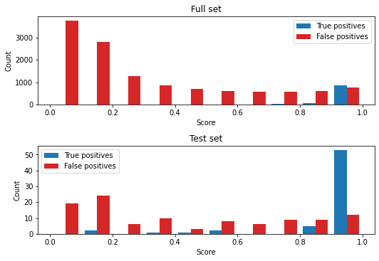
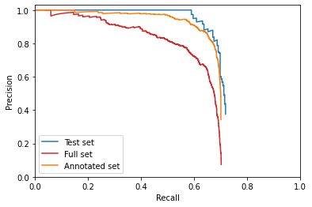

Evaluation of automatic annotations
===================================

This notebook demonstrates automatic annotation model evaluation.

First, load the required libraries.

.. code:: ipython3

    import json
    
    from matplotlib import pyplot as plt
    from matplotlib import mlab
    import numpy as np
    from scipy.stats import gaussian_kde

Next, load the validation data

.. code:: ipython3

    validation_file = "data/validation.json"
    validation_file_all = "data/validation_all.json"
    validation_file_annotated_only = "data/validation_annotated_only.json"
        
    with open(validation_file, "r") as f:
        validation = json.load(f)
        
    with open(validation_file_all, "r") as f:
        validation_all = json.load(f)
        
    with open(validation_file_annotated_only, "r") as f:
        validation_annotated_only = json.load(f)
        
    list(validation.keys())

.. parsed-literal::

    ['all_ious',
     'polyline_hausdorff_distances',
     'length_differences',
     'true_positives',
     'false_positives',
     'false_negatives']

Plot the Scores vs. Intersection over Union Density. A good model will
show a peak in the top-right corner, have a high mean IoU, and show
similar results for the full set and the test set.

.. code:: ipython3

    fig = plt.figure()
    
    ax = fig.add_subplot(
        111,
        xlabel="Intersection over Union",
        ylabel="Prediction score",
    )
    
    iou_X, iou_Y = np.mgrid[0.5:1.:100j, 0.:1.:100j]
    iou_positions = np.vstack([iou_X.ravel(), iou_Y.ravel()])
    
    # All images
    ious_all, iou_scores_all = zip(*validation_all["all_ious"])
    ious_all = np.array(ious_all)
    iou_scores_all = np.array(iou_scores_all)
    
    iou_kernel_all = gaussian_kde(np.vstack([ious_all, iou_scores_all]))
    iou_values_all = np.reshape(iou_kernel_all(iou_positions).T, iou_X.shape)
    
    p = ax.contourf(
        iou_X,
        iou_Y,
        iou_values_all,
        levels=10,
        cmap="Reds",
    )
    
    # Test set
    ious, iou_scores = zip(*validation["all_ious"])
    ious = np.array(ious)
    iou_scores = np.array(iou_scores)
    
    iou_kernel = gaussian_kde(np.vstack([ious, iou_scores]))
    iou_values = np.reshape(iou_kernel(iou_positions).T, iou_X.shape)
    
    p = ax.contour(
        iou_X,
        iou_Y,
        iou_values,
        levels=10,
        cmap="Blues_r",
    )
    
    print("mean IoU:")
    print(f"Full set: {np.mean(ious_all)}")
    print(f"Test set: {np.mean(ious)}")

.. parsed-literal::

    mean IoU:
    Full set: 0.8084382787232963
    Test set: 0.8003903525507208

.. code:: ipython3

    p.levels

.. parsed-literal::

    array([ 0.,  2.,  4.,  6.,  8., 10., 12., 14., 16., 18., 20.])

Plot the Scores vs. Hausdorff Distance Density. A good model will show a
peak in the top-left corner, have a low mean Hausdorff Distance, and
show similar results for the full set and the test set.

.. code:: ipython3

    fig = plt.figure()
    
    ax = fig.add_subplot(
        111,
        xlabel="Hausdorff distance",
        ylabel="Prediction score",
    )
    
    # All images
    phds_all, phd_scores_all = zip(*validation_all["polyline_hausdorff_distances"])
    phds_all = np.array(phds_all)
    phd_scores_all = np.array(phd_scores_all)
    
    # Test set
    phds, phd_scores = zip(*validation["polyline_hausdorff_distances"])
    phds = np.array(phds)
    phd_scores = np.array(phd_scores)
    
    max_phd = max(phds_all.max(), phds.max())
    
    phd_X, phd_Y = np.mgrid[0.:max_phd:100j, 0.:1.:100j]
    phd_positions = np.vstack([phd_X.ravel(), phd_Y.ravel()])
    
    # All images
    phd_kernel_all = gaussian_kde(np.vstack([phds_all, phd_scores_all]))
    phd_values_all = np.reshape(phd_kernel_all(phd_positions).T, phd_X.shape)
    
    p = ax.contourf(
        phd_X,
        phd_Y,
        phd_values_all,
        levels=10,
        cmap="Reds",
    )
    
    # Test set
    phd_kernel = gaussian_kde(np.vstack([phds, phd_scores]))
    phd_values = np.reshape(phd_kernel(phd_positions).T, phd_X.shape)
    
    p = ax.contour(
        phd_X,
        phd_Y,
        phd_values,
        levels=10,
        cmap="Blues_r",
    )
    
    print("mean Hausdorff distance:")
    print(f"Full set: {np.mean(phds_all)}")
    print(f"Test set: {np.mean(phds)}")

.. parsed-literal::

    mean Hausdorff distance:
    Full set: 28.548972369821694
    Test set: 26.8674040582616

Plot the Scores vs. Length Difference Density. A good model will show a
peak in the top-centre, have a low mean and standard deviation of length
difference, and show similar results for the full set and the test set.

.. code:: ipython3

    fig = plt.figure()
    
    ax = fig.add_subplot(
        111,
        xlabel="Length difference",
        ylabel="Prediction score",
    )
    
    # All images
    l_diffs_all, l_diff_scores_all = zip(*validation_all["length_differences"])
    l_diffs_all = np.array(l_diffs_all)
    l_diff_scores_all = np.array(l_diff_scores_all)
    
    # Test set
    l_diffs, l_diff_scores = zip(*validation["length_differences"])
    l_diffs = np.array(l_diffs)
    l_diff_scores = np.array(l_diff_scores)
    
    max_l_diff = max(np.abs(l_diffs_all).max(), np.abs(l_diffs).max())
    
    l_diff_X, l_diff_Y = np.mgrid[-max_l_diff:max_l_diff:100j, 0.:1.:100j]
    l_diff_positions = np.vstack([l_diff_X.ravel(), l_diff_Y.ravel()])
    
    # All images
    l_diff_kernel_all = gaussian_kde(np.vstack([l_diffs_all, l_diff_scores_all]))
    l_diff_values_all = np.reshape(l_diff_kernel_all(l_diff_positions).T, l_diff_X.shape)
    
    p = ax.contourf(
        l_diff_X,
        l_diff_Y,
        l_diff_values_all,
        levels=10,
        cmap="Reds",
    )
    
    # Test set
    l_diff_kernel = gaussian_kde(np.vstack([l_diffs, l_diff_scores]))
    l_diff_values = np.reshape(l_diff_kernel(l_diff_positions).T, l_diff_X.shape)
    
    p = ax.contour(
        l_diff_X,
        l_diff_Y,
        l_diff_values,
        levels=10,
        cmap="Blues_r",
    )
    
    print("mean length difference:")
    print(f"Full set: {np.mean(l_diffs_all)}")
    print(f"Test set: {np.mean(l_diffs)}")
    
    print("mean absolute length difference:")
    print(f"Full set: {np.mean(np.abs(l_diffs_all))}")
    print(f"Test set: {np.mean(np.abs(l_diffs))}")
    
    print("std length difference:")
    print(f"Full set: {np.std(l_diffs_all)}")
    print(f"Test set: {np.std(l_diffs)}")

.. parsed-literal::

    mean length difference:
    Full set: -8.985949664173894
    Test set: 2.3907378483120802
    mean absolute length difference:
    Full set: 28.526585350741474
    Test set: 26.85377608474589
    std length difference:
    Full set: 43.31024776806316
    Test set: 40.257610580046396

Plot the score histograms for true positives and false positives. A good
model will have a peak in true positives close to 1 and lower scores for
false positives.

.. code:: ipython3

    fig = plt.figure(
        figsize=(7.5, 5.2),
        tight_layout=True,
    )
    ax = fig.add_subplot(
        211,
        xlabel="Score",
        ylabel="Count",
        title="Full set",
    )
    
    
    h, b, p = ax.hist(
        [validation_all["true_positives"], validation_all["false_positives"]],
        bins=np.linspace(0., 1., num=11),
        label=["True positives", "False positives"],
        color=["tab:blue", "tab:red"],
    )
    ax.legend()
    
    ax = fig.add_subplot(
        212,
        xlabel="Score",
        ylabel="Count",
        title="Test set",
    )
    
    
    h, b, p = ax.hist(
        [validation["true_positives"], validation["false_positives"]],
        bins=np.linspace(0., 1., num=11),
        label=["True positives", "False positives"],
        color=["tab:blue", "tab:red"],
    )
    ax.legend()
    
    print("Full set:")
    print(f'True positives:  {len(validation_all["true_positives"]):4d}')
    print(f'False positives: {len(validation_all["false_positives"]):4d}')
    print(f'False negatives: {validation_all["false_negatives"]:4d}')
    
    print("\nTest set:")
    print(f'True positives:  {len(validation["true_positives"]):4d}')
    print(f'False positives: {len(validation["false_positives"]):4d}')
    print(f'False negatives: {validation["false_negatives"]:4d}')

.. parsed-literal::

    Full set:
    True positives:  1025
    False positives: 18352
    False negatives:  394
    
    Test set:
    True positives:    64
    False positives:  113
    False negatives:   25

Plot Precision vs. Recall and calculate average precision for the full
set, and the test set

.. code:: ipython3

    # Full set
    true_positives_all = np.array(validation_all["true_positives"])
    false_positives_all = np.array(validation_all["false_positives"])
    false_negatives_all = validation_all["false_negatives"]
    
    precision_all = [0.]
    recall_all = [1.]
    
    for score_cutoff in np.sort(np.concatenate((true_positives_all, false_positives_all))):
        tp = np.count_nonzero(true_positives_all >= score_cutoff)
        fp = np.count_nonzero(false_positives_all >= score_cutoff)
        try:
            pr = tp / (tp + fp)
            re = tp / (tp + false_negatives_all)
        except ZeroDivisionError:
            pass
        finally:
            precision_all.append(pr)
            recall_all.append(re)
            
    precision_all.append(1.)
    recall_all.append(0.)
            
    precision_all = np.array(precision_all)
    recall_all = np.array(recall_all)
    
    ap_precision_values_all = []
    for ap_recall_value in np.linspace(0., 1., num=11, endpoint=True):
        ap_precision_values_all.append(precision_all[recall_all >= ap_recall_value].max())
    
    average_precision_all = sum(ap_precision_values_all) / len(ap_precision_values_all)
    
    # Test set
    true_positives = np.array(validation["true_positives"])
    false_positives = np.array(validation["false_positives"])
    false_negatives = validation["false_negatives"]
    
    precision = [0.]
    recall = [1.]
    
    for score_cutoff in np.sort(np.concatenate((true_positives, false_positives))):
        tp = np.count_nonzero(true_positives >= score_cutoff)
        fp = np.count_nonzero(false_positives >= score_cutoff)
        try:
            pr = tp / (tp + fp)
            re = tp / (tp + false_negatives)
        except ZeroDivisionError:
            pass
        finally:
            precision.append(pr)
            recall.append(re)
            
    precision.append(1.)
    recall.append(0.)
            
    precision = np.array(precision)
    recall = np.array(recall)
    
    ap_precision_values = []
    for ap_recall_value in np.linspace(0., 1., num=11, endpoint=True):
        ap_precision_values.append(precision[recall >= ap_recall_value].max())
    
    average_precision = sum(ap_precision_values) / len(ap_precision_values)
    
    # Annotated only
    true_positives_annotated_only = np.array(validation_annotated_only["true_positives"])
    false_positives_annotated_only = np.array(validation_annotated_only["false_positives"])
    false_negatives_annotated_only = validation_annotated_only["false_negatives"]
    
    precision_annotated_only = [0.]
    recall_annotated_only = [1.]
    
    for score_cutoff in np.sort(np.concatenate((true_positives_annotated_only, false_positives_annotated_only))):
        tp = np.count_nonzero(true_positives_annotated_only >= score_cutoff)
        fp = np.count_nonzero(false_positives_annotated_only >= score_cutoff)
        try:
            pr = tp / (tp + fp)
            re = tp / (tp + false_negatives_annotated_only)
        except ZeroDivisionError:
            pass
        finally:
            precision_annotated_only.append(pr)
            recall_annotated_only.append(re)
            
    precision_annotated_only.append(1.)
    recall_annotated_only.append(0.)
            
    precision_annotated_only = np.array(precision_annotated_only)
    recall_annotated_only = np.array(recall_annotated_only)
    
    ap_precision_values_annotated_only = []
    for ap_recall_value in np.linspace(0., 1., num=11, endpoint=True):
        ap_precision_values_annotated_only.append(precision_annotated_only[recall_annotated_only >= ap_recall_value].max())
    
    average_precision_annotated_only = sum(ap_precision_values_annotated_only) / len(ap_precision_values_annotated_only)
       
    fig = plt.figure()
    ax = fig.add_subplot(
        111,
        xlabel="Recall",
        ylabel="Precision",
        xlim=(0., 1.),
        ylim=(0., 1.03),
    )
    ax.plot(recall[1:-1], precision[1:-1], c="tab:blue", label="Test set")
    ax.plot(recall_all[1:-1], precision_all[1:-1], c="tab:red", label="Full set")
    ax.plot(recall_annotated_only[1:-1], precision_annotated_only[1:-1], c="tab:orange", label="Annotated set")
    ax.legend()
    
    print("AP_50:")
    print(f"Full set: {average_precision_all}")
    print(f"Test set: {average_precision}")
    print(f"Annotated set: {average_precision_annotated_only}")

.. parsed-literal::

    AP_50:
    Full set: 0.6183247090779226
    Test set: 0.6823916331895055
    Annotated set: 0.6903068007027883

Putting together one figure

.. code:: ipython3

    def get_quantiles(values):
        """
        converts values to quantiles
        
        Parameters
        ----------
        
        values: array
            evenly spaced kde estimate values
            
        Returns
        -------
        
        quantiles: array of shape values.shape
            can be passed to plt.contour to produce quantile contour plot
            
        to_value: callable
            takes a quantile as an argument and converts to value
        """
        sort_indices = np.unravel_index(np.argsort(values, axis=None), values.shape)
        sorted_values = values[sort_indices]
        integral = np.cumsum(sorted_values) / sorted_values.sum()
        
        quantiles = np.empty_like(values)
        quantiles[sort_indices] = integral
        
        def to_value(quant):
            return sorted_values[np.nonzero(integral >= quant)[0][0]]
            
        return quantiles, to_value

.. code:: ipython3

    fontdict={"fontweight": "bold"}
    tloc = "right"
    ty = 0
    cmap_all = "Reds"
    cmap = "Blues_r"
    c_all = "tab:red"
    c = "tab:blue"
    quantiles = np.array([0.25, 0.5, 0.75, 0.9, 1.])
    quantiles_all = np.array([0.15, 0.25, 0.5, 0.75, 0.9, 1.])
    
    iou_xlabel = "Intersection over Union"
    phd_xlabel = "Hausdorff Distance (px)"
    l_diff_xlabel = "Length Difference (px)"
    
    iou_title = "a. "
    phd_title = "b. "
    l_diff_title = "c. "
    
    fig = plt.figure(
        figsize=(7.5, 5.2),
        #dpi=1000.0,
        tight_layout=True,
    )
    
    ax_loc = 220
    for metric in ["iou", "phd", "l_diff"]:
        ax_loc += 1
        xlabel = locals()[f"{metric}_xlabel"]
        X = locals()[f"{metric}_X"]
        Y = locals()[f"{metric}_Y"]
        values_all = locals()[f"{metric}_values_all"]
        values = locals()[f"{metric}_values"]
        s_all = locals()[f"{metric}s_all"]
        s = locals()[f"{metric}s"]
        kernel_all = locals()[f"{metric}_kernel_all"]
        kernel = locals()[f"{metric}_kernel"]
        scores_all = locals()[f"{metric}_scores_all"]
        scores = locals()[f"{metric}_scores"]
        title = locals()[f"{metric}_title"]
    
        ax = fig.add_subplot(
            ax_loc,
            xlabel=xlabel,
            ylabel="Prediction score",
        )
    
        quantile_values, to_value = get_quantiles(values_all)
        p_all = ax.contourf(
            X,
            Y,
            quantile_values,
            levels=quantiles_all,
            cmap=cmap_all,
        )
        p_all_outlier_mask = kernel_all(np.vstack([s_all, scores_all])) < to_value(p_all.levels[0])
        o_all = ax.plot(
            s_all[p_all_outlier_mask],
            scores_all[p_all_outlier_mask],
            marker=".",
            ls="",
            c=c_all,
        )
        quantile_values, to_value = get_quantiles(values)
        p = ax.contour(
            X,
            Y,
            quantile_values,
            levels=quantiles,
            cmap=cmap,
            zorder=10,
        )
        p_outlier_mask = kernel(np.vstack([s, scores])) < to_value(p.levels[0])
        o = ax.plot(
            s[p_outlier_mask],
            scores[p_outlier_mask],
            marker=".",
            ls="",
            c=c,
        )
        t = ax.set_title(
            title,
            fontdict=fontdict,
            loc=tloc,
            y=ty,
        )
    
    # Precision vs. Recall
    ax4 = fig.add_subplot(
        224,
        xlabel="Detection Recall",
        ylabel="Detection Precision",
        xlim=(0., 1.),
        ylim=(0., 1.03),
    )
    ax4.plot(
        recall_all[1:-1],
        precision_all[1:-1],
        c=c_all,
        label="Full set",
    )
    ax4.plot(
        recall[1:-1],
        precision[1:-1],
        c=c,
        label="Test set",
    )
    ax4.plot(
        recall_annotated_only[1:-1], 
        precision_annotated_only[1:-1],
        c="tab:orange",
        label="Annotated set",
    )
    t4 = ax4.set_title(
        "d. ",
        fontdict=fontdict,
        loc=tloc,
        y=ty,
    )
    
    # Hacking together the contours figure legend
    proxy = [plt.Rectangle((0, 0), 1, 1, fc=pc.get_facecolor()[0]) for pc in p_all.collections]
    proxy = list(np.insert(proxy, range(2, len(p.collections) + 1), p.collections[:-1]))
    labels = list(np.insert(quantiles_all[:-1], range(2, len(quantiles) + 1), quantiles[:-1]))
    proxy.insert(1, plt.Rectangle((0, 0), 1, 1, fc="None")),
    labels.insert(1, "")
    
    proxy1 = [plt.Rectangle((0, 0), 1, 1, fc="None"), plt.Rectangle((0, 0), 1, 1, fc="None")]
    #proxy1 = ["None", "None"]
    labels1 = ["Full set quantile:", "Test set quantile:"]
    
    proxy1.extend(proxy)
    labels1.extend(labels)
    
    leg = fig.legend(
        proxy1,
        labels1,
        loc="lower center",
        #title="Contour Quantile",
        ncol=len(quantiles_all),
        bbox_to_anchor=(0.5, -0.09),
        frameon=False,
        #markerfirst=False,
    )

.. image:: annotation_evaluation_files/annotation_evaluation_17_0.png

.. code:: ipython3

    fig.savefig("autoannotation_evaluation_figure.pdf", dpi=1000.0, bbox_inches="tight")
