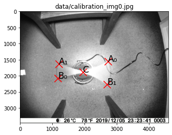
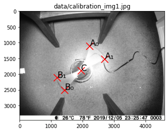
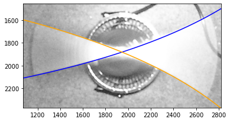
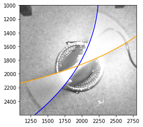
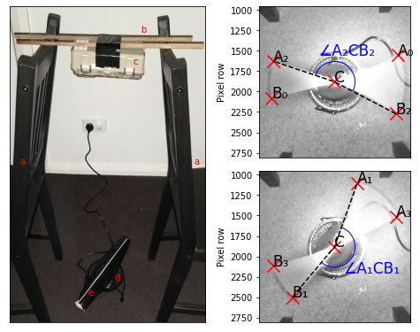

Camera calibration
==================

This notebook demonstrates how to measureme the rolling shutter line
rate of a camera.

Note that these calculations assume that the white line is rotating
clockwise in the image, and that the rolling shutter starts at the top
row and goes down through the rows. If you have a different
configuration, the easiest way of dealing with this would be to
reflect/rotate the image until it matches this assumption.

.. code:: ipython3

    # If you are using this notebook to measure your own cameras,
    # then using matplotlib in notebook mode may be helpful for finding
    # coordinates within the images (or you can use VIA or some other
    # image editing software). Uncomment the next line if you want to use
    # matplotlib for finding the coordinates
    
    #%matplotlib notebook
    
    from itertools import chain
    import math
    
    import numpy as np
    from imageio import imread
    from matplotlib import pyplot as plt
    from matplotlib import patches

First we will define a few functions which will help for calculating
rolling shutter line rate

.. code:: ipython3

    def get_angle(c, a, b):
        '''
        Get the angle of acb
        '''
        angle_a = np.arctan2(a[1] - c[1], a[0] - c[0])
        angle_b = np.arctan2(b[1] - c[1], b[0] - c[0])
        
        return angle_b - angle_a
    
    
    def get_linerate(angular_vel, centre, a, b):
        '''
        Get linerate from observations of pixels truning on or off
        '''
        angle = get_angle(centre, a, b)
        time = (angle - np.pi) / angular_vel
        rate = (b[1] - a[1]) / time
        
        return rate
    
    
    def simulate_rotation(t, linerate, angular_vel, centre, a_0):
        '''
        Get a curve simulating the rotation
        '''
        a_t = angular_vel * t + a_0
        y_t = linerate * t
        x_t = centre[0] + (y_t - centre[1]) / np.tan(a_t)
        
        return x_t, y_t

Next we load the calibration images and plot the various points of
interest on them (note you can use ``%matplotlib notebook`` to enable
interactive plots, which can help you find where these points should
be). For flexibility on the number of images used, we will define these
points in a list of dicts.

.. code:: ipython3

    ############### Edit this section to use your own data #########################
    # Specify image files
    calibration_img_files = [
        "data/calibration_img0.jpg",
        "data/calibration_img1.jpg",
    ]  # Update this list to use your own images
    
    # Specify points of interest
    points = [
        {
            "C": (1946, 1881),
            "A0": (2723, 1554),
            "B0": (1174, 2080),
            "A1": (1193, 1628),
            "B1": (2695, 2271),
        },
        {
            "C": (1946, 1881),
            "A0": (2225, 1100),
            "B0": (1429, 2498),
            "A1": (2702, 1514),
            "B1": (1190, 2116),
        },
    ]  # Update this list to use the points from your own images
    
    # Specify rotational velocity (units are rotations per second)
    rot_freqs = [
        3.679,
        3.679,
    ]  # Update this with your own measurement(s) (can be different for each image)
    ################################################################################
    
    assert len(points) == len(calibration_img_files), "Must have points definitions for each image"
    assert len(rot_freqs) == len(calibration_img_files), "Must have rotation frequency for each image"
    
    # Load images
    calibration_imgs = [imread(img_file) for img_file in calibration_img_files]
    
    # Plot images
    fontsize = 17
    markersize = 200
    for i in range(len(calibration_imgs)):
        fig = plt.figure()
        ax = fig.add_subplot(111, title=calibration_img_files[i])
        ax.set_xlim(0, calibration_imgs[i].shape[1])
        ax.set_ylim(calibration_imgs[i].shape[0], 0)
        ax.imshow(calibration_imgs[i])
        ax.scatter(*zip(*points[i].values()), marker='x',c='r', s=markersize)
        ax.annotate("A₀", points[i]["A0"], fontsize=fontsize)
        ax.annotate("B₀", points[i]["B0"], fontsize=fontsize)
        ax.annotate("A₁", points[i]["A1"], fontsize=fontsize)
        ax.annotate("B₁", points[i]["B1"], fontsize=fontsize)
        ax.annotate("C", points[i]["C"], fontsize=fontsize)

Now that we have input our data, we can calculate the rolling shutter
line rate

.. code:: ipython3

    angular_vels = [2 * np.pi * rot_freq for rot_freq in rot_freqs]
    
    on_rates, off_rates = [], []
    for i in range(len(calibration_imgs)):
        on_rates.append(get_linerate(
            angular_vels[i],
            points[i]["C"],
            points[i]["A0"],
            points[i]["B0"],
        ))
        off_rates.append(get_linerate(
            angular_vels[i],
            points[i]["C"],
            points[i]["A1"],
            points[i]["B1"],
        ))
        
    line_rate = np.mean([on_rates, off_rates])
    
    print("image_file_path \ton_rate \toff_rate")
    for i in range(len(calibration_imgs)):
        print(f"{calibration_img_files[i]}\t{on_rates[i]:.2e}\t{off_rates[i]:.2e}")
    
    
    print(f"\nMean rolling shutter line rate: {line_rate:.2e}")

.. parsed-literal::

    image_file_path 	on_rate 	off_rate
    data/calibration_img0.jpg	8.32e+04	9.53e+04
    data/calibration_img1.jpg	9.12e+04	9.24e+04
    
    Mean rolling shutter line rate: 9.05e+04

To assess the quality of this measurement, we can simulate the effect of
rolling shutter, and see how well it mateches the entirety of the
images. The following cell runs this simulation.

.. code:: ipython3

    # Define an independent variable (time) for the simulation
    t = np.linspace(1 / line_rate, calibration_imgs[0].shape[0] / line_rate, num=1000)
    
    for i in range(len(calibration_imgs)):
        # Calculate the time at A0 (start of exposure)
        time_A0 = points[i]["A0"][1] / line_rate
        # Calculate the angle of the white line at start of exposure at A0
        angle_A0 = np.arctan2(
            points[i]["A0"][1] - points[i]["C"][1],
            points[i]["A0"][0] - points[i]["C"][0],
        )
        # Calculate the angle of the white line at t = 0
        angle_t0_A0 = angle_A0 - angular_vels[i] * time_A0
        
        # Calculate the time at A1 (end of exposure)
        time_A1 = points[i]["A1"][1] / line_rate
        # Calculate the angle of the white line at end of exposure at A1
        angle_A1 = np.arctan2(
            points[i]["A1"][1] - points[i]["C"][1],
            points[i]["A1"][0] - points[i]["C"][0],
        )
        angle_t0_A1 = angle_A1 - angular_vels[i] * time_A1
        
        x_on, y_on = simulate_rotation(t, line_rate, angular_vels[i], points[i]["C"], angle_t0_A0)
        x_off, y_off = simulate_rotation(t, line_rate, angular_vels[i], points[i]["C"], angle_t0_A1)
        
        fig = plt.figure()
        ax= fig.add_subplot(111)
        ax.set_xlim(min([xy[0] for xy in points[i].values()]) - 100, max([xy[0] for xy in points[i].values()]) + 100)
        ax.set_ylim(max([xy[1] for xy in points[i].values()]) + 100, min([xy[1] for xy in points[i].values()]) - 100)
        ax.imshow(calibration_imgs[i])
        ax.plot(x_on, y_on, 'b')
        ax.plot(x_off, y_off, 'orange')

The blue curve indicates where the rotating line was when the exposure
turned on and the orange curve shows where the line was when the
exposure turned off. These curves should match the edges of the motion
blur traced by the rotating line closely. In our example, we see that
this worked very well.

Once satisfied that your measurement is accurate, you can proceed onto
the other analysis steps.

.. code:: ipython3

    fig_width = 180  # mm
    fig_width /= 25.4  # inches
    fig_height = fig_width * 3 / 4
    
    # Calculate cropping limits
    d_scale = 1.1
    d = 0
    
    centre = points[0]["C"]
    
    for p in chain.from_iterable(point_dict.values() for point_dict in points):
        d_pE = (p[0] - centre[0]) ** 2 + (p[1] - centre[1]) ** 2
        d = max(d, d_pE)
    d = math.sqrt(d) * d_scale
    
    xlim = (centre[0] - d, centre[0] + d)
    ylim = (centre[1] + d, centre[1] - d)
    
    # Plot figure
    fig = plt.figure(
        figsize=(fig_width, fig_height),
        tight_layout=True,
    )
    
    fontsize = 17
    markersize = 200
    point_names = [
        {
            "C": "C",
            "A0": "A₀",
            "B0": "B₀",
            "A1": "A₂",
            "B1": "B₂",
        },
        {
            "C": "C",
            "A0": "A₁",
            "B0": "B₁",
            "A1": "A₃",
            "B1": "B₃",
        },
    ]
    
    for i in range(2):
        ax = fig.add_subplot(222 + i * 2, xlim=xlim, ylim=ylim, ylabel="Pixel row")
        ax.imshow(calibration_imgs[i])
        ax.scatter(*zip(*points[i].values()), marker='x',c='r', s=markersize)
        ax.annotate(point_names[i]["B0"], points[i]["B0"], fontsize=fontsize)
        ax.annotate(point_names[i]["A1"], points[i]["A1"], fontsize=fontsize)
        ax.annotate(point_names[i]["A0"], points[i]["A0"], fontsize=fontsize)
        ax.annotate(point_names[i]["B1"], points[i]["B1"], fontsize=fontsize)
        ax.annotate("C", points[i]["C"], fontsize=fontsize)
        ax.plot(*zip(
            points[i][f"B{1 - i}"],
            points[i]["C"],
            points[i][f"A{1 - i}"]
        ), c='k', linestyle="dashed")
    
        arc_r = 500
    
        arc = patches.Arc(
            points[0]["C"],
            arc_r,
            arc_r,
            theta2=(180 / np.pi) * np.arctan2(
                points[i][f"B{1 - i}"][1] - points[i]["C"][1],
                points[i][f"B{1 - i}"][0] - points[i]["C"][0]
            ),
            theta1=(180 / np.pi) * np.arctan2(
                points[i][f"A{1 - i}"][1] - points[i]["C"][1],
                points[i][f"A{1 - i}"][0] - points[i]["C"][0]
            ),
            color="b",
        )
        ax.add_patch(arc)
        ax.annotate(
            ["∠A₂CB₂", "∠A₁CB₁"][i],
            [(2100, 1400), (2400, 2050)][i],
            fontsize=fontsize,
            verticalalignment="top",
            horizontalalignment="center",
            color="b",
        )
        ax.set_xticks([])
    #ax0.set_yticks([])
    
    
    calibration_setup_img = imread("data/calibration_setup.jpg")
    ax3 = fig.add_subplot(121)
    ax3.imshow(calibration_setup_img)
    
    ax3.annotate("a", (100, 1500), c="r")
    ax3.annotate("a", (1750, 1500), c="r")
    ax3.annotate("b", (1250, 250), c="r")
    ax3.annotate("c", (1175, 550), c="r")
    ax3.annotate("d", (1000, 2600), c="r")
    ax3.annotate("e", (750, 2750), c="r")
    
    ax3.set_xticks([])
    _ = ax3.set_yticks([])

.. code:: ipython3

    fig.savefig("rolling_shutter_calibration.pdf", dpi=600.0, pad_inches=0.0)
