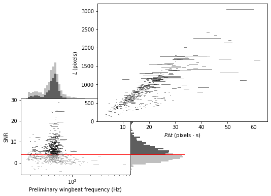
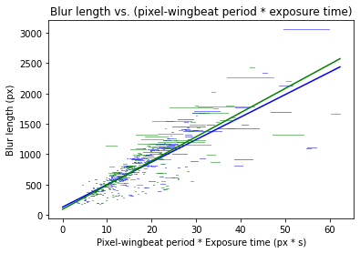
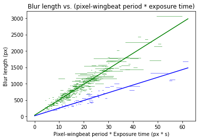

Wingbeat analysis
=================

This notebook demonstrates how to analyse wingbeat data output from
camfi.

First, load the required libraries.

.. code:: ipython3

    import math
    
    from bces import bces
    import matplotlib as mpl
    from matplotlib import pyplot as plt
    import numpy as np
    from numpy.random import default_rng
    from scipy.stats import norm
    from sklearn.mixture import GaussianMixture

Next, load the wingbeat frequency data. It is in a tab-separated format
with the following columns:

1.  ``image_name`` : relative path to image
2.  ``capture_time`` : datetime in yyyy-mm-dd HH:MM:SS format
3.  ``annotation_idx`` : index of annotation in image (arbitrary)
4.  ``best_peak`` : period of wingbeat in pixels
5.  ``blur_length`` : length of motion blur in pixels
6.  ``snr`` : signal to noise ratio of best peak
7.  ``wb_freq_up`` : wingbeat frequency estimate, assuming upward motion
    (and zero body-length)
8.  ``wb_freq_down`` : wingbeat frequency estimate, assuming downward
    motion (and zero body-length)
9.  ``et_up`` : corrected moth exposure time, assuming upward motion
10. ``et_dn`` : corrected moth exposure time, assuming downward motion
11. ``period_up`` : wingbeat period, assuming upward motion (and zero
    body-length)
12. ``period_dn`` : wingbeat period, assuming downward motion (and zero
    body-length)
13. ``spec_dens`` : comma separated values, with the spectral density
    array associated with the annotation

For the purposes of this notebook, we are particularly interested in
wingbeat frequency, so we will only load the relevant columns. For other
analyses you may want to load additional columns such as
``capture_time`` etc.

.. code:: ipython3

    data_path = "data/cabramurra_wingbeats.csv.bz2"
    
    data = np.loadtxt(
        data_path,
        dtype=[
            ('best_peak', 'u2'),
            ('blur_length', 'u2'),
            ('snr', 'f8'),
            ('wb_freq_up', 'f8'),
            ('wb_freq_dn', 'f8'),
            ('et_up', 'f8'),
            ('et_dn', 'f8')
        ],
        usecols=(3, 4, 5, 6, 7, 8, 9),
        delimiter='\t',
        skiprows=1,
    )

Next we want to filter the data by SNR.

.. code:: ipython3

    snr_thresh = 4.0

Visualising the data, with the SNR threshold indicated:

.. code:: ipython3

    filtered_data = data[data['snr'] >= snr_thresh]
    
    # Setting up the figure with multiple subfigures
    left, width = 0.1, 0.4
    bottom, height = 0.1, 0.4
    hist_height = 0.2
    spacing = 0
    spacing_regression = -0.12
    
    rect_scatter = [left, bottom, width, height]
    rect_histx = [left, bottom + height + spacing, width, hist_height]
    rect_histy = [left + width + spacing, bottom, hist_height, height]
    rect_regression = [
        left + width + spacing_regression,
        bottom + height + spacing_regression,
        1. - left - width - spacing_regression,
        1. - bottom - height - spacing_regression,
    ]
    
    fig = plt.figure(
        figsize=(7.5, 5.2),
        #dpi=1000.0,
    )
    
    # Plotting preliminary wingbeat frequency data with marginal distributions
    ax = fig.add_axes(
        rect_scatter,
        xlabel="Preliminary wingbeat frequency (s⁻¹)",
        ylabel="SNR",
        xscale="log",
    )
    # Plot above-threshold data
    ax.plot(
        np.stack((
            data['wb_freq_dn'][data['snr'] >= snr_thresh],
            data['wb_freq_up'][data['snr'] >= snr_thresh],
        )),
        np.broadcast_to(
            data['snr'][data['snr'] >= snr_thresh],
            (2,) + data[data['snr'] >= snr_thresh].shape,
        ),
        c="k",
        alpha=0.5,
        lw=1,
    )
    # Plot below-threshold data
    ax.plot(
        np.stack((
            data['wb_freq_dn'][data['snr'] < snr_thresh],
            data['wb_freq_up'][data['snr'] < snr_thresh],
        )),
        np.broadcast_to(
            data['snr'][data['snr'] < snr_thresh],
            (2,) + data[data['snr'] < snr_thresh].shape,
        ),
        c="grey",
        alpha=0.5,
        lw=1,
    )
        
    ax.axhline(snr_thresh, c="r", zorder=0, label="SNR Threshold")
    
    # Plotting marginals
    ax_histx = fig.add_axes(rect_histx, sharex=ax)
    ax_histy = fig.add_axes(rect_histy, sharey=ax)
    
    # no labels
    ax_histx.axis("off")
    ax_histy.axis("off")
    
    
    hx, bx, p = ax_histx.hist(
        np.concatenate([
            data['wb_freq_dn'],
            data['wb_freq_up']
        ]),
        bins=np.logspace(
            np.log10(min(data['wb_freq_dn'])),
            np.log10(max(data['wb_freq_up']))
        ),
        facecolor="grey",
        alpha=0.5,
    )
    
    hx_filt, bx_filt, p = ax_histx.hist(
        np.concatenate([
            filtered_data['wb_freq_dn'],
            filtered_data['wb_freq_up']
        ]),
        bins=bx,
        facecolor="k",
        alpha=0.5,
    )
    
    hy, by, p = ax_histy.hist(
        data['snr'],
        bins=50,
        orientation='horizontal',
        facecolor="grey",
        alpha=0.5,
    )
    
    ax_histy.hist(
        filtered_data['snr'],
        bins=by,
        orientation='horizontal',
        facecolor="k",
        alpha=0.5,
    )
    
    # SNR threshold line should be continued into the marginal
    ax_histy.axhline(snr_thresh, c="r", zorder=1, label="SNR Threshold")
    
    # Plotting blur length vs. pixel-period * ∆t for filtered data only
    ax_regression = fig.add_axes(
        rect_regression,
        ylabel="$L$ (pixels)",
        xlabel="$P∆t$ (pixels · s)",
    )
    
    p = ax_regression.plot(
        np.stack((
            filtered_data["best_peak"] * filtered_data["et_up"],
            filtered_data["best_peak"] * filtered_data["et_dn"],
        )),
        np.broadcast_to(
            filtered_data["blur_length"],
            (2,) + filtered_data.shape,
        ),
        c="k",
        alpha=0.5,
        lw=1,
    )

Based on the above plots, we now wish to select a number of target
classes. This will be used for fitting a Gaussian mixture-model to the
preliminary winbeat frequencies (which assume zero bodylength), and for
classification in the linear regression step for the unbiased estimate
of wingbeat frequency.

.. code:: ipython3

    n_classes = 2

Fitting the Gaussian mixture-model to the preliminary wingbeat data:

.. code:: ipython3

    gmm = GaussianMixture(n_components=n_classes, random_state=20200721)
    labels = gmm.fit_predict(
        np.log10(np.concatenate([
            filtered_data['wb_freq_dn'],
            filtered_data['wb_freq_up']
        ])).reshape(-1, 1))
    
    print("converged:", gmm.converged_)
    
    labels = labels[:filtered_data.shape[0]] + labels[filtered_data.shape[0]:]

.. parsed-literal::

    converged: True

Now we use an EM algorithm to classify the data using BCES regressions
of :math:`L` vs. :math:`P \Delta t`. Here we will plot the result of the
regression under the initial randomisation as well as after the final EM
iteration

.. code:: ipython3

    rng = default_rng(20201008)
    
    # E-step
    class_mask = rng.integers(0, n_classes, len(filtered_data), "u1")
    prob_class = np.array([np.mean(class_mask == i) for i in range(n_classes)])
    n_class_members = np.array([np.count_nonzero(class_mask == i) for i in range(n_classes)])
    tiled_class_mask = np.tile(class_mask, 2)
    
    def bces_em(data, class_mask, prob_class, n_classes):
        xerr = data["best_peak"] * (data["et_dn"] - data["et_up"]) / 2
        yerr = np.zeros_like(xerr)
        x = data["best_peak"] * data["et_up"] + xerr
        y = data["blur_length"]
        cov = np.zeros_like(x)
        
        estimates = []
        err = np.zeros((n_classes, len(data)))
        for class_id in range(n_classes):
            mask = class_mask == class_id
            wf_estimate, bl_estimate, wf_err, bl_err, cov_wf_bl = (
                e[0] for e in bces.bces(x[mask], xerr[mask], y[mask], yerr[mask], cov[mask])
            )
            estimates.append((wf_estimate, bl_estimate, wf_err, bl_err, cov_wf_bl))
            
            err[class_id, :] = (bl_estimate + wf_estimate * x - y) ** 2 / prob_class[class_id]
            
        return estimates, err
    
    
    def plot_multiple_regression(data, class_mask, estimates):
        cmap = np.array(["b", "g", "r", "k"])
        fig = plt.figure()
        ax = fig.add_subplot(
            111,
            title="Blur length vs. (pixel-wingbeat period * exposure time)",
            ylabel="Blur length (px)",
            xlabel="Pixel-wingbeat period * Exposure time (px * s)",
        )
    
        for i in range(len(estimates)):
            # Plot data
            ax.plot(
                np.stack((
                    (data["best_peak"] * data["et_up"])[class_mask == i],
                    (data["best_peak"] * data["et_dn"])[class_mask == i],
                )),
                np.broadcast_to(
                    data["blur_length"][class_mask == i],
                    (2,) + data[class_mask == i].shape,
                ),
                c=cmap[i],
                alpha=0.5,
                lw=1,
            )
               
            # Plot regression line
            wf_estimate, bl_estimate, wf_err, bl_err, cov_wf_bl = estimates[i]
            ax.plot(
                [0, max(data["best_peak"] * data["et_dn"])],
                [bl_estimate, wf_estimate * max(data["best_peak"] * data["et_dn"]) + bl_estimate],
                c=cmap[i]
            )
    
    
    for i in range(50):
        estimates, err = bces_em(filtered_data, class_mask, prob_class, n_classes)
        if i == 0:
            plot_multiple_regression(filtered_data, class_mask, estimates)
        class_mask_temp = np.argmin(err, axis=0)
        if (class_mask == class_mask_temp).all():
            print(f"stopped after iteration {i}")
            break
        
        if i == 0:
            j = 0
            for wf_estimate, bl_estimate, wf_err, bl_err, cov_wf_bl in estimates:
                print(f"\n--- Iteration {i}, Regression {j}")
                print(f"prob_class:, {prob_class[j]}")
                print(f"Wingbeat frequency: {wf_estimate} +/- {wf_err} Hz")
                print(f"Body length: {bl_estimate} +/- {bl_err} px")
                print(f"Covariance: {cov_wf_bl}")
                j += 1
        
        class_mask[:] = class_mask_temp
        prob_class = np.array([np.mean(class_mask == i) for i in range(n_classes)])
        n_class_members = np.array([np.count_nonzero(class_mask == i) for i in range(n_classes)])
            
    plot_multiple_regression(filtered_data, class_mask, estimates)
    j = 0
    for wf_estimate, bl_estimate, wf_err, bl_err, cov_wf_bl in estimates:
        print(f"\n--- Iteration {i}, Regression {j}")
        print(f"prob_class:, {prob_class[j]}")
        print(f"n_class_members:, {n_class_members[j]}")
        print(f"Wingbeat frequency: {wf_estimate} +/- {wf_err} Hz")
        print(f"Body length: {bl_estimate} +/- {bl_err} px")
        print(f"Covariance: {cov_wf_bl}")
        j += 1

.. parsed-literal::

    
    --- Iteration 0, Regression 0
    prob_class:, 0.467687074829932
    Wingbeat frequency: 37.063683080358814 +/- 3.5250747416266788 Hz
    Body length: 127.85101522566015 +/- 47.81817737917329 px
    Covariance: -165.34240492286315
    
    --- Iteration 0, Regression 1
    prob_class:, 0.532312925170068
    Wingbeat frequency: 39.80546342745053 +/- 2.755691942102085 Hz
    Body length: 91.65510681931562 +/- 37.57809201311573 px
    Covariance: -100.27083282528011
    stopped after iteration 11
    
    --- Iteration 11, Regression 0
    prob_class:, 0.1326530612244898
    n_class_members:, 78
    Wingbeat frequency: 23.466053959690015 +/- 1.556810066609258 Hz
    Body length: 18.48362816432251 +/- 26.19545270649577 px
    Covariance: -39.134953347059586
    
    --- Iteration 11, Regression 1
    prob_class:, 0.8673469387755102
    n_class_members:, 510
    Wingbeat frequency: 47.216324294653226 +/- 1.3084396195710057 Hz
    Body length: 36.269535893196235 +/- 17.388466508134254 px
    Covariance: -21.960631386433548

Finally, we reproduce the figure from the publication, which includes
the GMM and EM classification

.. code:: ipython3

    filtered_data = data[data['snr'] >= snr_thresh]
    
    a_alpha = 1.
    b_alpha = 0.5
    
    # Setting up the figure with multiple subfigures
    left, width = 0.1, 0.4
    bottom, height = 0.1, 0.4
    hist_height = 0.2
    spacing = 0
    spacing_regression = -0.12
    
    rect_scatter = [left, bottom, width, height]
    rect_histx = [left, bottom + height + spacing, width, hist_height]
    rect_histy = [left + width + spacing, bottom, hist_height, height]
    rect_regression = [
        left + width + spacing_regression,
        bottom + height + spacing_regression,
        1. - left - width - spacing_regression,
        1. - bottom - height - spacing_regression,
    ]
    
    fig = plt.figure(
        figsize=(7.5, 5.2),
        #dpi=1000.0,
    )
    
    # Plotting preliminary wingbeat frequency data with marginal distributions
    ax = fig.add_axes(
        rect_scatter,
        xlabel="Preliminary wingbeat frequency (s⁻¹)",
        ylabel="SNR",
        xscale="log",
        xlim=(10, 1000),
    )
    
    # Plot above-threshold data
    ax.plot(
        np.stack((
            data['wb_freq_dn'][data['snr'] >= snr_thresh],
            data['wb_freq_up'][data['snr'] >= snr_thresh],
        )),
        np.broadcast_to(
            data['snr'][data['snr'] >= snr_thresh],
            (2,) + data[data['snr'] >= snr_thresh].shape,
        ),
        c="k",
        alpha=a_alpha,
        lw=1,
    )
    # Plot below-threshold data
    ax.plot(
        np.stack((
            data['wb_freq_dn'][data['snr'] < snr_thresh],
            data['wb_freq_up'][data['snr'] < snr_thresh],
        )),
        np.broadcast_to(
            data['snr'][data['snr'] < snr_thresh],
            (2,) + data[data['snr'] < snr_thresh].shape,
        ),
        c="grey",
        alpha=a_alpha,
        lw=1,
    )
        
    ax.axhline(snr_thresh, c="r", zorder=10, label="SNR Threshold")
    
    # Plotting marginals
    ax_histx = fig.add_axes(rect_histx, sharex=ax)
    ax_histy = fig.add_axes(rect_histy, sharey=ax)
    
    # no labels
    ax_histx.axis("off")
    ax_histy.axis("off")
    
    
    hx, bx, p = ax_histx.hist(
        np.concatenate([
            data['wb_freq_dn'],
            data['wb_freq_up']
        ]),
        bins=np.logspace(
            np.log10(min(data['wb_freq_dn'])),
            np.log10(max(data['wb_freq_up']))
        ),
        facecolor="grey",
        alpha=a_alpha,
    )
    
    hx_filt, bx_filt, p = ax_histx.hist(
        np.concatenate([
            filtered_data['wb_freq_dn'],
            filtered_data['wb_freq_up']
        ]),
        bins=bx,
        facecolor="k",
        alpha=a_alpha,
    )
    
    # Plotting GMM
    scaling = np.mean(hx_filt * (bx_filt[1:] - bx_filt[:-1])) / 2
    
    pdf_x0 = np.logspace(
        gmm.means_[0][0] - math.sqrt(gmm.covariances_[0][0]) * 4,
        gmm.means_[0][0] + math.sqrt(gmm.covariances_[0][0]) * 4,
        num=100,
    )
    
    ax_histx.plot(
        pdf_x0,
        scaling * gmm.weights_[0] * norm.pdf(np.log10(pdf_x0), loc=gmm.means_[0][0], scale=math.sqrt(gmm.covariances_[0][0])),
        c='g',
        label="0",
    )
    
    pdf_x1 = np.logspace(
        gmm.means_[1][0] - math.sqrt(gmm.covariances_[1][0]) * 4,
        gmm.means_[1][0] + math.sqrt(gmm.covariances_[1][0]) * 4,
        num=100,
    )
    
    ax_histx.plot(
        pdf_x1,
        scaling * gmm.weights_[1] * norm.pdf(np.log10(pdf_x1), loc=gmm.means_[1][0], scale=math.sqrt(gmm.covariances_[1][0])),
        c='b',
        label="2",
    )
    
    # Plotting vertical marginal
    # First need to pin bin edges to snr_thresh to avoid overlap
    min_snr = data['snr'].min()
    max_snr = data['snr'].max()
    nbins = 50
    by = np.linspace(
        min_snr - (max_snr - min_snr) / nbins,
        max_snr,
        num=nbins + 1,
    )
    by += snr_thresh - by[by <= snr_thresh][-1]
    
    hy, by, p = ax_histy.hist(
        data['snr'],
        bins=by,
        orientation='horizontal',
        facecolor="grey",
        alpha=a_alpha,
    )
    
    ax_histy.hist(
        filtered_data['snr'],
        bins=by,
        orientation='horizontal',
        facecolor="k",
        alpha=a_alpha,
    )
    
    # SNR threshold line should be continued into the marginal
    ax_histy.axhline(snr_thresh, c="r", zorder=1, label="SNR Threshold")
    
    # Plotting blur length vs. pixel-period * ∆t for filtered data only
    ax_regression = fig.add_axes(
        rect_regression,
        ylabel="$L$ (pixels)",
        xlabel="$P∆t$ (pixels · s)",
    )
    
    # Define colours for each class
    cmap = np.array(["b", "g", "r", "k"])
    assert len(cmap) >= n_classes, "Need to define more colours"
    
    for i in range(len(estimates)):
        # Plot the data
        ax_regression.plot(
            np.stack((
                (filtered_data["best_peak"] * filtered_data["et_up"])[class_mask == i],
                (filtered_data["best_peak"] * filtered_data["et_dn"])[class_mask == i],
            )),
            np.broadcast_to(
                filtered_data["blur_length"][class_mask == i],
                (2,) + filtered_data[class_mask == i].shape,
            ),
            c=cmap[i],
            alpha=b_alpha,
            lw=1,
        )
        
        # Plot the regression lines
        wf_estimate, bl_estimate, wf_err, bl_err, cov_wf_bl = estimates[i]
        ax_regression.plot(
            [0, max(data["best_peak"] * data["et_dn"])],
            [bl_estimate, wf_estimate * max(data["best_peak"] * data["et_dn"]) + bl_estimate],
            c=cmap[i]
        )
        
    # Add titles
    title_y = 0.88
    a_title = ax.set_title(
        " a.",
        fontdict={"fontweight": "bold"},
        loc="left",
        y=title_y
    )
    b_title = ax_regression.set_title(
        " b.",
        fontdict={"fontweight": "bold"},
        loc="left",
        y=title_y
    )

.. image:: wingbeat_analysis_files/wingbeat_analysis_15_0.png

.. code:: ipython3

    fig.savefig("wingbeat_frequency_figure.pdf", dpi=1000.0, pad_inches=0.0)
