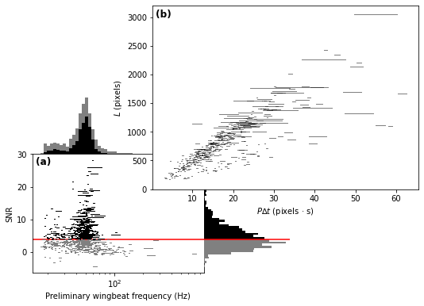
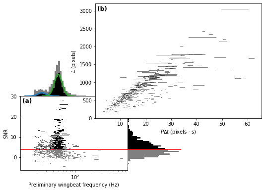
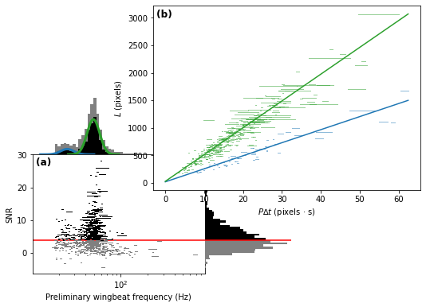

Wingbeat analysis
=================

This notebook demonstrates how to analyse wingbeat data output from
camfi.

First, load the required libraries.

.. code:: ipython3

    from pathlib import Path
    
    from matplotlib import pyplot as plt
    import numpy as np
    
    from camfi.datamodel.locationtime import LocationTime, LocationTimeCollector
    from camfi.datamodel.via import ViaProject
    from camfi.plotting.matplotlib import MatplotlibWingbeatFrequencyPlotter
    from camfi.wingbeat import WingbeatExtractor, BcesEM, GMM

To run ``via_project.load_all_exif_metadata`` and
``wingbeat_extractor.extract_wingbeats()`` below, you will first need to
download the dataset ``2019-11_cabramurra.zip`` from the Zenodo
repository. The link to the repository is here:

`DOI <https://doi.org/10.5281/zenodo.4950570>`__

If you uncomment the code in the next three code cells, it is assumed
you have extracted the images to ``"data/"``. Of course you can extract
it elsewhere and change ``image_root`` accordingly.

``"data/cabramurra_all_annotations.json"`` already contains all the
wingbeat data we need, so in this instance, we don’t need to re-run the
time-consuming metadata and wingbeat extraction code. Therefore, we
don’t need the image files.

The next cell loads the annotations, and the location and time data used
to correct the camera timestamps, which can often be out (either if the
camera was set incorrectly, or if it just has an inaccurate clock… which
is often the case for cheap cameras).

.. code:: ipython3

    image_root = Path("data/")
    data_path = "data/cabramurra_all_annotations.json"
    
    via_project = ViaProject.parse_file(data_path)
        
    locationtime_path = "data/cabramurra_locationtimes.json"
    locationtimes = LocationTimeCollector.parse_file(locationtime_path)

To get the timestamps for the images, we need to read the EXIF metadata
from the image files. Here we also apply time correction. The code is
commented out since the metadata has already been loaded into
``"data/cabramurra_all_annotations.json"``, but if you are working with
a different dataset, or would like to re-run this step, uncomment the
code.

.. code:: ipython3

    # Uncomment if exif metadata hasn't been loaded already.
    # via_project.load_all_exif_metadata(
    #     root=image_root,
    #     location_dict=locationtimes.get_location_dict(),
    #     datetime_correctors=locationtimes.get_correctors(
    #         camera_time_to_actual_time_ratio=1.0
    #     )
    # )

After the EXIF metadata has been loaded, we can run the camfi algorithm
to measure the wingbeat frequencies of moths seen in the images. Again,
this has already been run and the data is included in
``"data/cabramurra_all_annotations.json"``, so only uncomment if you
have downloaded the image dataset and want to re-run (or you are running
on your own dataset).

.. code:: ipython3

    # Uncomment if wingbeat data hasn't been extracted already
    # for img_key, metadata in via_project.via_img_metadata.items():
    #     wingbeat_extractor = WingbeatExtractor(
    #         metadata=metadata,
    #         root=image_root,
    #         line_rate=9.05e+04,   # This needs to be measured beforehand.
    #         device="cuda",        # Set to "cpu" if you don't have an
    #                               # Nvidia GPU. Or use another device
    #                               # supported by torch.
    #         backup_device="cpu",  # This allows the algorithm to recover
    #                               # from RuntimeErrors caused by running
    #                               # out of memory on the GPU. Delete if
    #                               # you set device="cpu".
    #     )
    #     wingbeat_extractor.extract_wingbeats()
    #     via_project.via_img_metadata[img_key] = wingbeat_extractor.metadata

The ``camfi.datamodel.via.ViaProject`` class is useful for loading and
validating files which are compatible with VIA, however for some
analyses it is more convenient to have a Pandas DataFrame. The
``to_region_dataframe`` method of ``camfi.datamodel.via.ViaProject``
makes this conversion simple.

.. code:: ipython3

    regions = via_project.to_region_dataframe()
    regions

.. raw:: html

    

    
    <table border="1" class="dataframe">
      <thead>
        <tr style="text-align: right;">
          <th></th>
          <th>img_key</th>
          <th>filename</th>
          <th>name</th>
          <th>datetime_corrected</th>
          <th>datetime_original</th>
          <th>exposure_time</th>
          <th>location</th>
          <th>pixel_x_dimension</th>
          <th>pixel_y_dimension</th>
          <th>score</th>
          <th>best_peak</th>
          <th>blur_length</th>
          <th>snr</th>
          <th>wb_freq_up</th>
          <th>wb_freq_down</th>
          <th>et_up</th>
          <th>et_dn</th>
        </tr>
      </thead>
      <tbody>
        <tr>
          <th>0</th>
          <td>2019-11_cabramurra/0001/DSCF0009.JPG-1</td>
          <td>2019-11_cabramurra/0001/DSCF0009.JPG</td>
          <td>polyline</td>
          <td>2019-11-14 20:20:26+11:00</td>
          <td>2019-11-14 20:20:26</td>
          <td>0.111111</td>
          <td>cabramurra</td>
          <td>4608</td>
          <td>3456</td>
          <td>None</td>
          <td>111.0</td>
          <td>536.292725</td>
          <td>12.966407</td>
          <td>44.505436</td>
          <td>41.726944</td>
          <td>0.107531</td>
          <td>0.114691</td>
        </tr>
        <tr>
          <th>1</th>
          <td>2019-11_cabramurra/0001/DSCF0010.JPG-1</td>
          <td>2019-11_cabramurra/0001/DSCF0010.JPG</td>
          <td>polyline</td>
          <td>2019-11-14 20:30:29+11:00</td>
          <td>2019-11-14 20:30:29</td>
          <td>0.111111</td>
          <td>cabramurra</td>
          <td>4608</td>
          <td>3456</td>
          <td>None</td>
          <td>237.0</td>
          <td>1008.291016</td>
          <td>5.783094</td>
          <td>40.686996</td>
          <td>35.853527</td>
          <td>0.104095</td>
          <td>0.118128</td>
        </tr>
        <tr>
          <th>2</th>
          <td>2019-11_cabramurra/0001/DSCF0010.JPG-1</td>
          <td>2019-11_cabramurra/0001/DSCF0010.JPG</td>
          <td>polyline</td>
          <td>2019-11-14 20:30:29+11:00</td>
          <td>2019-11-14 20:30:29</td>
          <td>0.111111</td>
          <td>cabramurra</td>
          <td>4608</td>
          <td>3456</td>
          <td>None</td>
          <td>165.0</td>
          <td>675.603577</td>
          <td>21.689453</td>
          <td>36.698574</td>
          <td>36.494766</td>
          <td>0.110802</td>
          <td>0.111421</td>
        </tr>
        <tr>
          <th>3</th>
          <td>2019-11_cabramurra/0001/DSCF0010.JPG-1</td>
          <td>2019-11_cabramurra/0001/DSCF0010.JPG</td>
          <td>polyline</td>
          <td>2019-11-14 20:30:29+11:00</td>
          <td>2019-11-14 20:30:29</td>
          <td>0.111111</td>
          <td>cabramurra</td>
          <td>4608</td>
          <td>3456</td>
          <td>None</td>
          <td>116.0</td>
          <td>660.467407</td>
          <td>6.046125</td>
          <td>51.069618</td>
          <td>50.624634</td>
          <td>0.110625</td>
          <td>0.111597</td>
        </tr>
        <tr>
          <th>4</th>
          <td>2019-11_cabramurra/0001/DSCF0010.JPG-1</td>
          <td>2019-11_cabramurra/0001/DSCF0010.JPG</td>
          <td>circle</td>
          <td>2019-11-14 20:30:29+11:00</td>
          <td>2019-11-14 20:30:29</td>
          <td>0.111111</td>
          <td>cabramurra</td>
          <td>4608</td>
          <td>3456</td>
          <td>None</td>
          <td>NaN</td>
          <td>NaN</td>
          <td>NaN</td>
          <td>NaN</td>
          <td>NaN</td>
          <td>NaN</td>
          <td>NaN</td>
        </tr>
        <tr>
          <th>...</th>
          <td>...</td>
          <td>...</td>
          <td>...</td>
          <td>...</td>
          <td>...</td>
          <td>...</td>
          <td>...</td>
          <td>...</td>
          <td>...</td>
          <td>...</td>
          <td>...</td>
          <td>...</td>
          <td>...</td>
          <td>...</td>
          <td>...</td>
          <td>...</td>
          <td>...</td>
        </tr>
        <tr>
          <th>1414</th>
          <td>2019-11_cabramurra/0010/DSCF0747.JPG-1</td>
          <td>2019-11_cabramurra/0010/DSCF0747.JPG</td>
          <td>point</td>
          <td>2019-11-24 23:21:23+11:00</td>
          <td>2019-11-24 23:21:23</td>
          <td>0.100000</td>
          <td>cabramurra</td>
          <td>4608</td>
          <td>3456</td>
          <td>None</td>
          <td>NaN</td>
          <td>NaN</td>
          <td>NaN</td>
          <td>NaN</td>
          <td>NaN</td>
          <td>NaN</td>
          <td>NaN</td>
        </tr>
        <tr>
          <th>1415</th>
          <td>2019-11_cabramurra/0010/DSCF0777.JPG-1</td>
          <td>2019-11_cabramurra/0010/DSCF0777.JPG</td>
          <td>polyline</td>
          <td>2019-11-25 04:22:54+11:00</td>
          <td>2019-11-25 04:22:54</td>
          <td>0.100000</td>
          <td>cabramurra</td>
          <td>4608</td>
          <td>3456</td>
          <td>None</td>
          <td>107.0</td>
          <td>520.138428</td>
          <td>11.467738</td>
          <td>48.212074</td>
          <td>48.084389</td>
          <td>0.099867</td>
          <td>0.100133</td>
        </tr>
        <tr>
          <th>1416</th>
          <td>2019-11_cabramurra/0010/DSCF0779.JPG-1</td>
          <td>2019-11_cabramurra/0010/DSCF0779.JPG</td>
          <td>polyline</td>
          <td>2019-11-25 04:43:00+11:00</td>
          <td>2019-11-25 04:43:00</td>
          <td>0.100000</td>
          <td>cabramurra</td>
          <td>4608</td>
          <td>3456</td>
          <td>None</td>
          <td>82.0</td>
          <td>389.173492</td>
          <td>3.202193</td>
          <td>47.306557</td>
          <td>46.436455</td>
          <td>0.099072</td>
          <td>0.100928</td>
        </tr>
        <tr>
          <th>1417</th>
          <td>2019-11_cabramurra/0010/DSCF0780.JPG-1</td>
          <td>2019-11_cabramurra/0010/DSCF0780.JPG</td>
          <td>polyline</td>
          <td>2019-11-25 04:53:04+11:00</td>
          <td>2019-11-25 04:53:04</td>
          <td>0.100000</td>
          <td>cabramurra</td>
          <td>4608</td>
          <td>3456</td>
          <td>None</td>
          <td>129.0</td>
          <td>591.514160</td>
          <td>5.017477</td>
          <td>46.047268</td>
          <td>45.040775</td>
          <td>0.098895</td>
          <td>0.101105</td>
        </tr>
        <tr>
          <th>1418</th>
          <td>2019-11_cabramurra/0010/DSCF0851.JPG-1</td>
          <td>2019-11_cabramurra/0010/DSCF0851.JPG</td>
          <td>point</td>
          <td>2019-11-26 04:43:00+11:00</td>
          <td>2019-11-26 04:43:00</td>
          <td>0.100000</td>
          <td>cabramurra</td>
          <td>4608</td>
          <td>3456</td>
          <td>None</td>
          <td>NaN</td>
          <td>NaN</td>
          <td>NaN</td>
          <td>NaN</td>
          <td>NaN</td>
          <td>NaN</td>
          <td>NaN</td>
        </tr>
      </tbody>
    </table>
    
1419 rows × 17 columns

    

Next we want proceed with just polyline annotations (as these are the
only type which enable wingbeat measurement), and we also want to filter
the data by an SNR threshold.

.. code:: ipython3

    snr_thresh = 4.0
    polyline_regions = regions[regions["name"] == "polyline"]
    above_thresh = polyline_regions[polyline_regions["snr"] >= snr_thresh]

We can already visualise the data, with the SNR threshold indicated by a
red line.

.. code:: ipython3

    plotter = MatplotlibWingbeatFrequencyPlotter(
        polyline_regions=polyline_regions,
        snr_thresh=snr_thresh,
    )
    fig = plotter.plot()

Based on the above plots, we now wish to select a number of target
classes. This will be used for fitting a Gaussian mixture-model to the
preliminary winbeat frequencies (which assume zero bodylength), and for
classification in the linear regression step for the unbiased estimate
of wingbeat frequency.

.. code:: ipython3

    n_classes = 2

Operating on the preliminary wingbeat data (figure a), we can fit a
Gaussian mixture-model.

.. code:: ipython3

    gmm = GMM.log10_from_region_dataframe(
        above_thresh,
        n_classes,
        seed=1234567890  # Not reuired to set, but makes the results
                         # reproducible
    )
    gmm_results = sorted(gmm.fit())  # Order of classes is random, so we sort
                                     # to make it predictable.

We can then plot the figure with the Gaussian mixture model shown.

.. code:: ipython3

    plotter = MatplotlibWingbeatFrequencyPlotter(
        polyline_regions=polyline_regions,
        snr_thresh=snr_thresh,
        gmm_results=gmm_results,
    )
    fig = plotter.plot()

Now we use an EM algorithm to classify the data using BCES regressions
of :math:`L` vs. :math:`P \Delta t`.

.. code:: ipython3

    bces_em = BcesEM.from_region_dataframe(
        above_thresh, n_classes, seed=1234567890
    )
    bces_results = bces_em.fit()

The order of the classes is random, so we sort to make them predictable
(and line up better with the sorted classes from the GMM). This will
make colouring comparable across the two models. Unfortunately we can’t
*just* sort ``bces_results``, because then the colours of the scatter
plot wouldn’t be guaranteed to match the regression lines. We have to
also re-map the ``bces_em.class_mask`` values.

This can do this re-mapping with some indexing trickery using
``np.argsort``, and then we can sort ``bces_results`` the normal way.

.. code:: ipython3

    inverse_index = np.argsort(np.argsort(bces_results))
    class_mask = inverse_index[bces_em.class_mask]
    bces_results = sorted(bces_results)

Finally, we reproduce the figure from the publication, which includes
both the GMM and EM classification

.. code:: ipython3

    plotter = MatplotlibWingbeatFrequencyPlotter(
        polyline_regions=polyline_regions,
        snr_thresh=snr_thresh,          # Must be the same threshold used to
                                        # make the class_mask.
        class_mask=class_mask,          # Adds colour to the measurements
        gmm_results=gmm_results,        # Include the GMM plots
        bces_results=bces_results,      # Include the BCES regression lines
    )
    fig = plotter.plot()

``fig`` is just a matplotlib ``Figure`` instance, so we can save it
quite easily.

.. code:: ipython3

    fig.savefig("wingbeat_frequency_figure.pdf", dpi=600.0, pad_inches=0.0)
